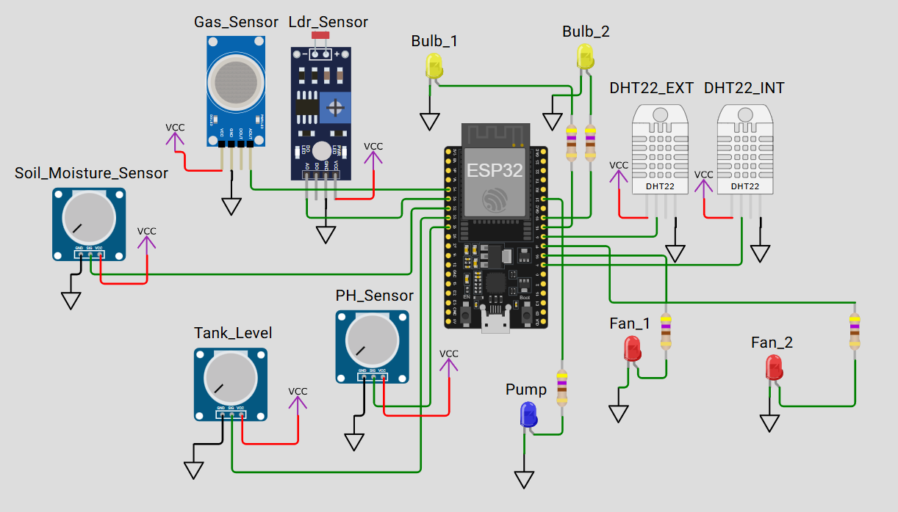
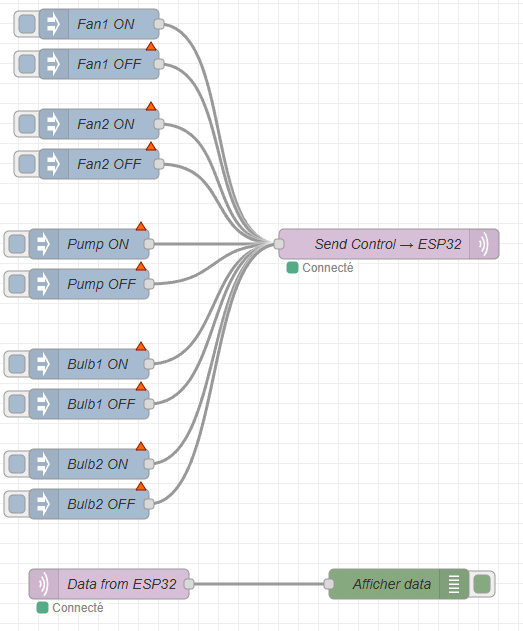

# Smart Greenhouse IoT Simulation

A complete IoT smart greenhouse system simulated on Wokwi, featuring ESP32-based environmental monitoring and automated control via MQTT and Node-RED.

## Project Overview

This project implements a smart greenhouse management system that monitors environmental conditions and automatically controls actuators (fans, lights, pump) based on sensor readings. The system can also be manually controlled through Node-RED.



## Features

### Sensors
- **DHT22 (Indoor)**: Temperature and humidity monitoring inside the greenhouse
- **DHT22 (Outdoor)**: External temperature and humidity reference
- **Gas Sensor**: Air quality monitoring
- **LDR (Light Sensor)**: Ambient light detection
- **Soil Moisture Sensor**: Monitors soil water content
- **pH Sensor**: Soil acidity level
- **Tank Level Sensor**: Water reservoir monitoring

### Actuators
- **Fan 1 & Fan 2**: Temperature regulation (red LEDs)
- **Bulb 1**: pH warning indicator (yellow LED)
- **Bulb 2**: Lighting control based on light levels (yellow LED)
- **Pump**: Automatic irrigation system (blue LED)

### Automation Logic
- **Fans**: Activate when indoor temperature exceeds 28°C
- **Bulb 2**: Turns on when light level is too low
- **Bulb 1**: Activates when pH is out of range (1500-3000)
- **Pump**: Activates when soil is dry AND water tank has sufficient level

## Setup Instructions

### 1. Wokwi Simulation

1. Open the project in [Wokwi](https://wokwi.com/)
2. Load the provided files:
   - `diagram.json` - Circuit configuration
   - `src/main.cpp` - ESP32 firmware
   - `platformio.ini` - PlatformIO configuration
   - `wokwi.toml` - Wokwi settings

3. Start the simulation - the ESP32 will automatically connect to `Wokwi-GUEST` WiFi

### 2. MQTT Broker

The system uses **test.mosquitto.org** as the public MQTT broker:
- **Host**: test.mosquitto.org
- **Port**: 1883
- **Topics**:
  - `greenhouse/data` - Sensor data published by ESP32 (every 10 seconds)
  - `greenhouse/control` - Commands to control actuators

### 3. Node-RED Setup



1. Import `node_red.json` into your Node-RED instance
2. Install required nodes:
   ```bash
   npm install node-red-contrib-mqtt-broker
   ```
3. The MQTT broker is already configured to `test.mosquitto.org:1883`
4. Deploy the flow

### 4. Control Interface

Use the inject nodes in Node-RED to manually control actuators:

- **Fan1 ON/OFF**: Toggle first ventilation fan
- **Fan2 ON/OFF**: Toggle second ventilation fan  
- **Pump ON/OFF**: Manual irrigation control
- **Bulb1 ON/OFF**: Control pH indicator
- **Bulb2 ON/OFF**: Control lighting

Click the button on any inject node to send the command to the ESP32.

## Data Format

### Published Data (greenhouse/data)
```json
{
  "TempIndoor": 25.50,
  "HumIndoor": 65.20,
  "TempOutdoor": 22.30,
  "HumOutdoor": 70.10,
  "Soil": 1800,
  "Tank": 2500,
  "pH": 2400,
  "Light": 1500,
  "Gas": 300,
  "Fan1": 0,
  "Fan2": 0,
  "Bulb1": 0,
  "Bulb2": 1,
  "Pump": 0
}
```

### Control Commands (greenhouse/control)
```json
{"fan1": 1}      // Turn on Fan1
{"fan2": 0}      // Turn off Fan2
{"pump": 1}      // Turn on Pump
{"bulb1": 0}     // Turn off Bulb1
{"bulb2": 1}     // Turn on Bulb2
```

## Testing

1. **Start Wokwi simulation** - ESP32 connects and publishes data every 10s
2. **Open Node-RED debug panel** - Verify data reception
3. **Adjust sensor potentiometers** in Wokwi to simulate environmental changes
4. **Use inject nodes** to manually override automatic control
5. **Monitor serial output** in Wokwi for real-time feedback

## Technical Stack

- **Hardware**: ESP32 DevKit C V4
- **Platform**: PlatformIO
- **Libraries**: 
  - PubSubClient (MQTT)
  - DHT sensor library
- **Communication**: MQTT over WiFi
- **Automation**: Node-RED
- **Simulation**: Wokwi

## Project Structure

```
.
├── src/
│   └── main.cpp              # ESP32 firmware
├── diagram.json              # Wokwi circuit
├── platformio.ini            # Build configuration
├── wokwi.toml               # Wokwi settings
├── node_red.json            # Node-RED flow
└── README.md                # This file
```
