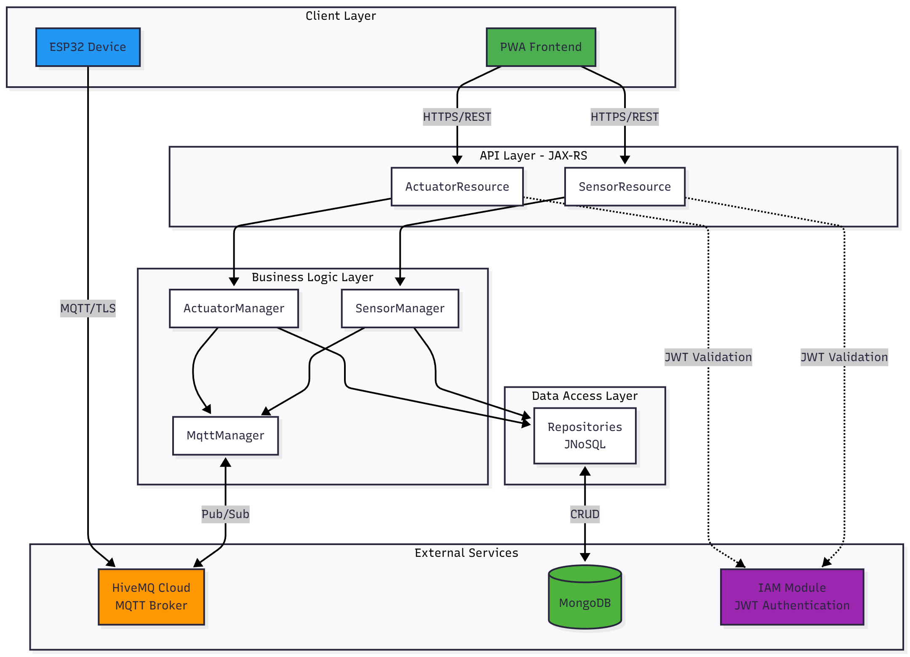
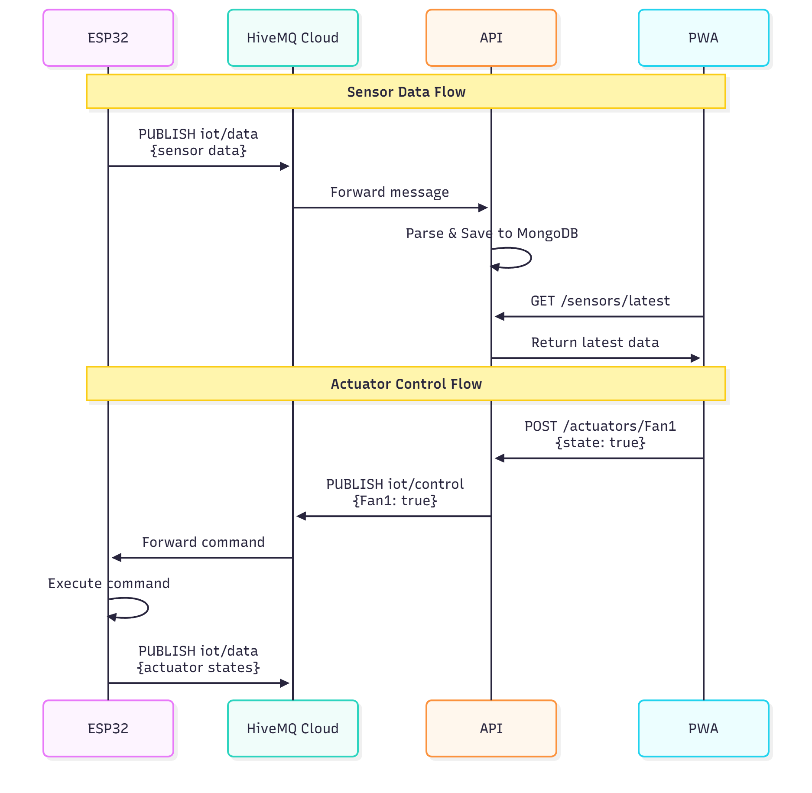

# 🌱 Smart Greenhouse API

## 📋 Table of Contents

- [Overview](#-overview)
- [Architecture](#-architecture)
- [Technologies and Dependencies](#-technologies-and-dependencies)
- [Installation and Configuration](#-installation-and-configuration)
- [API Endpoints](#-api-endpoints)
- [MQTT Communication](#-mqtt-communication)
- [Security](#-security)
- [Database](#-database)
- [Testing](#-testing)
- [Deployment](#-deployment)
- [Monitoring and Logs](#-monitoring-and-logs)

---

## 🎯 Overview

The **API** module is the heart of the Smart Greenhouse system. It provides a RESTful interface for:

- 📊 **Sensor Data Management**: Retrieval and storage of environmental measurements
- 🎛️ **Actuator Control**: Sending commands to IoT devices (fans, lights, pump)
- 🔌 **MQTT Integration**: Bi-directional communication with ESP32 devices
- 🔐 **Authentication and Authorization**: Integration with IAM module via JWT

### Main Features

- ✅ Real-time collection of data from 9 different sensor types
- ✅ Manual and automatic control of 5 actuators
- ✅ Persistent storage in MongoDB
- ✅ Secure communication via HiveMQ Cloud (TLS/SSL)
- ✅ Integrated OpenAPI documentation
- ✅ Unit tests with JUnit 5 and Mockito

---

## 🏗️ Architecture

### Project Structure

```
api/
├── src/
│   ├── main/
│   │   ├── java/com/greenhouse/
│   │   │   ├── boundaries/          # REST endpoints (JAX-RS)
│   │   │   │   ├── ActuatorResource.java
│   │   │   │   └── SensorResource.java
│   │   │   ├── controllers/         # Business logic
│   │   │   │   ├── managers/        # Service managers
│   │   │   │   ├── repositories/    # Data access layer (JNoSQL)
│   │   │   │   └── mqtt/            # MQTT client management
│   │   │   ├── entities/            # Domain models
│   │   │   │   ├── Actuator.java
│   │   │   │   └── SensorData.java
│   │   │   ├── filters/             # JAX-RS filters
│   │   │   │   ├── CORSFilter.java
│   │   │   │   └── JWTAuthenticationFilter.java
│   │   │   ├── security/            # Security utilities
│   │   │   └── JAXRSConfiguration.java
│   │   ├── resources/
│   │   │   └── META-INF/
│   │   │       └── microprofile-config.properties
│   │   └── webapp/
│   │       └── WEB-INF/
│   └── test/
│       └── java/com/greenhouse/     # Unit tests
├── pom.xml
└── README.md
```

### Layered Architecture



---

## 🛠️ Technologies and Dependencies

### Frameworks and APIs

| Technology | Version | Description |
|------------|---------|-------------|
| **Jakarta EE** | 10.0.0 | Enterprise application platform |
| **JAX-RS** | Included | REST API (endpoints) |
| **CDI** | Included | Dependency injection |
| **JSON-B** | Included | JSON serialization/deserialization |
| **MicroProfile Config** | 3.1 | Externalized configuration |
| **MicroProfile OpenAPI** | 3.1.1 | Automatic API documentation |

### Database and Persistence

| Technology | Version | Description |
|------------|---------|-------------|
| **Eclipse JNoSQL MongoDB** | 1.0.3 | NoSQL abstraction for MongoDB |
| **MongoDB Driver Sync** | 4.11.1 | Official MongoDB driver |

### Communication and Security

| Technology | Version | Description |
|------------|---------|-------------|
| **Eclipse Paho MQTT** | 1.2.5 | MQTT client for Java |
| **Argon2-JVM** | 2.11 | Secure password hashing |

### Utilities

| Technology | Version | Description |
|------------|---------|-------------|
| **Apache Commons Lang3** | 3.17.0 | Java utilities |
| **JSON** | 20240303 | JSON manipulation |
| **SLF4J** | 1.7.36 | Logging facade |

### Testing

| Technology | Version | Description |
|------------|---------|-------------|
| **JUnit 5** | 5.10.1 | Unit testing framework |
| **Mockito** | 5.5.0 | Mocking framework |

### Application Server

- **WildFly** 37+ (with Jakarta EE 10 support)
- **Java** 21

---

## 📦 Installation and Configuration

### Prerequisites

1. **Java Development Kit (JDK) 21**
   ```bash
   java -version
   # Should display: openjdk version "21.x.x"
   ```

2. **Apache Maven 3.9+**
   ```bash
   mvn -version
   ```

3. **MongoDB 8.0+** (local or cloud)
   - Local installation: https://www.mongodb.com/try/download/community
   - Or use MongoDB Atlas (free cloud)

4. **WildFly 37+**
   - Download from: https://www.wildfly.org/downloads/
   - Or use WildFly Maven plugin

### Installation Steps

#### 1. Clone the Project

```bash
cd "c:\Users\marwe\Desktop\Nouveau dossier (4)\api"
```

#### 2. MongoDB Configuration

**Option A: Local MongoDB**

```bash
# Start MongoDB
mongod --dbpath C:\data\db
```

**Option B: MongoDB Atlas (Cloud)**

1. Create account at https://www.mongodb.com/cloud/atlas
2. Create free cluster
3. Get connection string
4. Update `microprofile-config.properties`

#### 3. MQTT Configuration (HiveMQ Cloud)

The project currently uses **HiveMQ Cloud** with TLS/SSL.

**Current settings** (in `microprofile-config.properties`):
- **Broker**: `f7650e29f2d1418ab38a502a12ae2a8e.s1.eu.hivemq.cloud`
- **Port**: `8883` (MQTT over TLS)
- **Username**: `marwen`
- **Topics**:
  - Sensors (receive): `iot/data`
  - Actuators (publish): `iot/control`

> ⚠️ **Security**: For production, change MQTT credentials!

#### 4. Configuration File

Edit `src/main/resources/META-INF/microprofile-config.properties`:

```properties
# MongoDB Configuration
jnosql.document.database=CoT_Project
jnosql.mongodb.host=localhost:27017
# For MongoDB Atlas, use:
# jnosql.mongodb.host=cluster0.xxxxx.mongodb.net/?retryWrites=true&w=majority&appName=Cluster0
jnosql.document.provider=org.eclipse.jnosql.databases.mongodb.communication.MongoDBDocumentConfiguration

# MQTT Configuration - HiveMQ Cloud
mqtt.uri=ssl://f7650e29f2d1418ab38a502a12ae2a8e.s1.eu.hivemq.cloud:8883
mqtt.username=YOUR_USERNAME
mqtt.password=YOUR_PASSWORD
mqtt.topic.sensors=iot/data
mqtt.topic.actuators=iot/control

# IAM Configuration
iam.url=http://localhost:8080/iam/rest-iam
```

#### 5. Compilation

```bash
mvn clean package
```

This generates: `target/smartgreenhouse.war`

#### 6. Deployment on WildFly

**Option A: Manual Deployment**

```bash
# Copy WAR to WildFly deployment folder
copy target\smartgreenhouse.war %WILDFLY_HOME%\standalone\deployments\

# Start WildFly
%WILDFLY_HOME%\bin\standalone.bat
```

**Option B: Maven Deployment**

```bash
mvn wildfly:deploy
```

#### 7. Verification

The API will be accessible at:
- **Base URL**: http://localhost:8080/smartgreenhouse/rest
- **OpenAPI Docs**: http://localhost:8080/smartgreenhouse/openapi
- **Health Check**: Test with `curl http://localhost:8080/smartgreenhouse/rest/sensors`

---

## 🔌 API Endpoints

### Base URL

```
http://localhost:8080/smartgreenhouse/rest
```

### 📊 Sensor Endpoints

#### 1. Get All Sensor Data

```http
GET /sensors
```

**Response 200 OK**:
```json
[
  {
    "_id": "674c123abc456def78901234",
    "temperature_indoor": 25.5,
    "humidity_indoor": 60.2,
    "temperature_outdoor": 18.3,
    "humidity_outdoor": 75.1,
    "soil_moisture": 2100,
    "tank_level": 1500,
    "ph_level": 2200,
    "light_intensity": 1800,
    "gas_level": 450,
    "measurement_time": "2025-12-01T20:30:15Z"
  }
]
```

#### 2. Get Latest Data

```http
GET /sensors/latest
```

**Response 200 OK**: Returns the most recent entry.

#### 3. Create New Measurement (used by MQTT)

```http
POST /sensors
Content-Type: application/json
```

**Body**:
```json
{
  "TempIndoor": 26.0,
  "HumIndoor": 62.0,
  "TempOutdoor": 19.0,
  "HumOutdoor": 70.0,
  "Soil": 2050,
  "Tank": 1400,
  "pH": 2300,
  "Light": 1900,
  "Gas": 480
}
```

### 🎛️ Actuator Endpoints

#### 1. Get All Actuator States

```http
GET /actuators
```

**Response 200 OK**:
```json
{
  "Fan1": true,
  "Fan2": true,
  "Bulb1": false,
  "Bulb2": true,
  "Pump": false
}
```

#### 2. Control Specific Actuator

```http
POST /actuators/{actuatorName}
Content-Type: application/json
```

**Parameters**:
- `actuatorName`: `Fan1`, `Fan2`, `Bulb1`, `Bulb2`, or `Pump`

**Body**:
```json
{
  "state": true
}
```

**Response 200 OK**:
```json
{
  "message": "Command sent for Fan1: ON"
}
```

> 📡 **Note**: The command is published on MQTT topic `iot/control` and executed immediately by the ESP32.

---

## 📡 MQTT Communication

### Communication Architecture



### MQTT Topics

| Topic | Direction | Description | Format |
|-------|-----------|-------------|--------|
| `iot/data` | ESP32 → API | Sensor data and actuator states | JSON |
| `iot/control` | API → ESP32 | Commands for actuators | JSON |

### Message Formats

**Topic `iot/data` (ESP32 → API)**:
```json
{
  "TempIndoor": 25.5,
  "HumIndoor": 60.2,
  "TempOutdoor": 18.3,
  "HumOutdoor": 75.1,
  "Soil": 2100,
  "Tank": 1500,
  "pH": 2200,
  "Light": 1800,
  "Gas": 450,
  "Fan1": 1,
  "Fan2": 1,
  "Bulb1": 0,
  "Bulb2": 1,
  "Pump": 0,
  "Mode": "manual"
}
```

**Topic `iot/control` (API → ESP32)**:
```json
{
  "Fan1": true,
  "Fan2": false,
  "Bulb1": true,
  "Bulb2": false,
  "Pump": true
}
```

### MQTT Client Configuration

The MQTT client is managed by `MqttManager` which:
- ✅ Automatically connects to HiveMQ Cloud broker
- ✅ Uses TLS/SSL for secure connection
- ✅ Subscribes to `iot/data` topic on startup
- ✅ Automatically reconnects on disconnection
- ✅ Parses JSON messages and saves to MongoDB

---

## 🔐 Security

### JWT Authentication

The API uses **JSON Web Tokens (JWT)** provided by the IAM module.

**Authentication flow**:

1. User logs in via IAM module
2. IAM generates a JWT and returns it in an HttpOnly cookie
3. PWA sends this cookie with each request to the API
4. `JWTAuthenticationFilter` validates the JWT before authorizing access

### CORS (Cross-Origin Resource Sharing)

The `CORSFilter` allows requests from:
- `http://localhost:8000` (PWA in development)
- `http://127.0.0.1:8000`

**Allowed headers**:
```
Access-Control-Allow-Origin: http://localhost:8000
Access-Control-Allow-Methods: GET, POST, PUT, DELETE, OPTIONS
Access-Control-Allow-Headers: Content-Type, Authorization
Access-Control-Allow-Credentials: true
```

### Secure MQTT

- ✅ **TLS/SSL**: Encrypted connection on port 8883
- ✅ **Authentication**: Username/password for broker
- ✅ **Private topics**: Only authorized clients can publish

### Best Practices

⚠️ **For production**:
1. Change MQTT credentials
2. Use HTTPS for API
3. Configure firewall for MongoDB
4. Enable MongoDB authentication
5. Use managed secrets (Vault, AWS Secrets Manager, etc.)

---

## 💾 Database

### MongoDB - Collection Structure

#### Collection: `SensorData`

```javascript
{
  "_id": ObjectId("674c123abc456def78901234"),
  "temperature_indoor": 25.5,        // °C
  "humidity_indoor": 60.2,           // %
  "temperature_outdoor": 18.3,       // °C
  "humidity_outdoor": 75.1,          // %
  "soil_moisture": 2100,             // 0-4095 (ADC)
  "tank_level": 1500,                // 0-4095 (ADC)
  "ph_level": 2200,                  // 0-4095 (ADC)
  "light_intensity": 1800,           // 0-4095 (ADC)
  "gas_level": 450,                  // 0-4095 (ADC)
  "measurement_time": ISODate("2025-12-01T20:30:15Z")
}
```

#### Collection: `Actuator`

```javascript
{
  "_id": "Fan1",
  "name": "Fan1",
  "state": true,
  "last_updated": ISODate("2025-12-01T20:35:00Z")
}
```

**Available actuators**:
- `Fan1`: Fan 1 (temperature control)
- `Fan2`: Fan 2 (temperature control)
- `Bulb1`: Light 1 (pH alert)
- `Bulb2`: Light 2 (grow light)
- `Pump`: Water pump (irrigation)

### Database Operations

#### Recommended Indexing

```javascript
// Index on measurement_time to optimize chronological queries
db.SensorData.createIndex({ "measurement_time": -1 })

// Index on _id for actuators
db.Actuator.createIndex({ "_id": 1 })
```

#### Useful Queries

**Last 100 measurements**:
```javascript
db.SensorData.find().sort({ measurement_time: -1 }).limit(100)
```

**Measurements from last 24h**:
```javascript
db.SensorData.find({
  measurement_time: {
    $gte: new Date(Date.now() - 24*60*60*1000)
  }
}).sort({ measurement_time: -1 })
```

**Current state of all actuators**:
```javascript
db.Actuator.find()
```

---

## 🧪 Testing

### Running Unit Tests

```bash
# Run all tests
mvn test

# Run specific test
mvn test -Dtest=ActuatorManagerTest

# With coverage report (if configured)
mvn clean test jacoco:report
```

### Test Structure

```
src/test/java/com/greenhouse/
├── controllers/
│   └── managers/
│       ├── ActuatorManagerTest.java
│       ├── SensorManagerTest.java
│       └── MqttManagerTest.java
```

### Test Example

```java
@ExtendWith(MockitoExtension.class)
public class ActuatorManagerTest {
    
    @Mock
    private ActuatorRepository repository;
    
    @Mock
    private MqttManager mqttManager;
    
    @InjectMocks
    private ActuatorManager actuatorManager;
    
    @Test
    void testControlActuator_Success() {
        // Given
        String actuatorName = "Fan1";
        boolean newState = true;
        
        // When
        actuatorManager.controlActuator(actuatorName, newState);
        
        // Then
        verify(mqttManager).publishActuatorCommand(actuatorName, newState);
        verify(repository).save(any(Actuator.class));
    }
}
```

---

## 🚀 Deployment

### Local Deployment (WildFly)

```bash
# 1. Build the project
mvn clean package

# 2. Start WildFly
%WILDFLY_HOME%\bin\standalone.bat

# 3. Deploy the WAR
copy target\smartgreenhouse.war %WILDFLY_HOME%\standalone\deployments\
```

### Docker Deployment

**Create `Dockerfile`**:

```dockerfile
FROM quay.io/wildfly/wildfly:37.0.0.Final-jdk21

# Copy WAR
COPY target/smartgreenhouse.war /opt/wildfly/standalone/deployments/

# Expose port
EXPOSE 8080

# Start WildFly
CMD ["/opt/wildfly/bin/standalone.sh", "-b", "0.0.0.0"]
```

**Build and Run**:

```bash
# Build image
docker build -t smart-greenhouse-api .

# Run container
docker run -d -p 8080:8080 \
  -e MONGODB_URI="mongodb://localhost:27017" \
  --name greenhouse-api \
  smart-greenhouse-api
```

### Cloud Deployment (AWS, Azure, GCP)

The application can be deployed on:
- **AWS Elastic Beanstalk** (Java)
- **Azure App Service** (Java)
- **Google Cloud Run** (with containerization)

---

## 📊 Monitoring and Logs

### WildFly Logs

```bash
# View logs in real-time
tail -f %WILDFLY_HOME%\standalone\log\server.log
```

### Logging Configuration

Add to `src/main/resources/logging.properties`:

```properties
# Log level for application
com.greenhouse.level=INFO

# Log level for MQTT
org.eclipse.paho.level=DEBUG

# Log level for JNoSQL
org.eclipse.jnosql.level=INFO
```

### Health Check Endpoints

```http
GET /smartgreenhouse/rest/sensors/latest
```

If this endpoint responds with 200 OK, the application is functional.

---

## 📝 Release Notes

### v1.0 - Current Features

- ✅ Complete REST API for sensors and actuators
- ✅ MQTT integration with HiveMQ Cloud
- ✅ MongoDB storage with JNoSQL
- ✅ JWT authentication via IAM
- ✅ CORS configured for PWA
- ✅ Unit tests with Mockito
- ✅ OpenAPI documentation

### Future Improvements

- 🔄 Add endpoints for statistics and charts
- 🔄 WebSocket implementation for real-time push
- 🔄 Configurable automation rules
- 🔄 Detailed command history
- 🔄 Real-time alerts (email/SMS)

---

## 🤝 Support and Contribution

For questions or issues:

1. Check WildFly logs
2. Verify MongoDB connection
3. Verify MQTT connection with HiveMQ
4. Consult OpenAPI documentation

---

## 📄 License

This project is developed as part of an academic Smart Greenhouse project.
