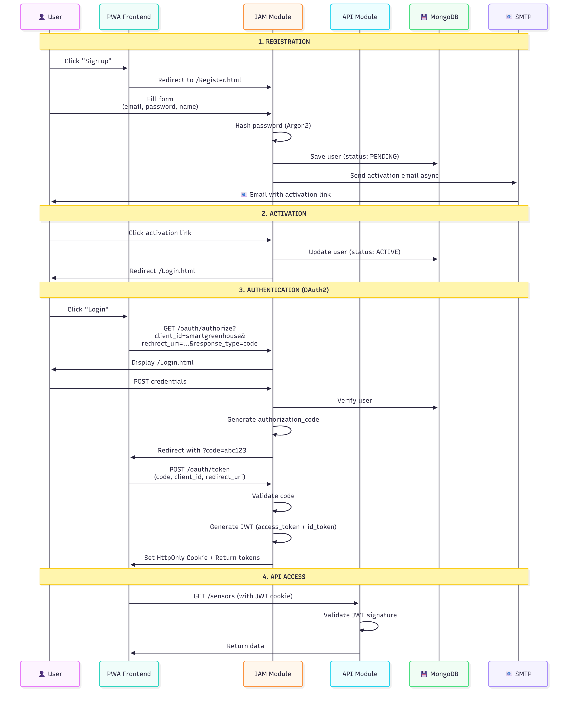
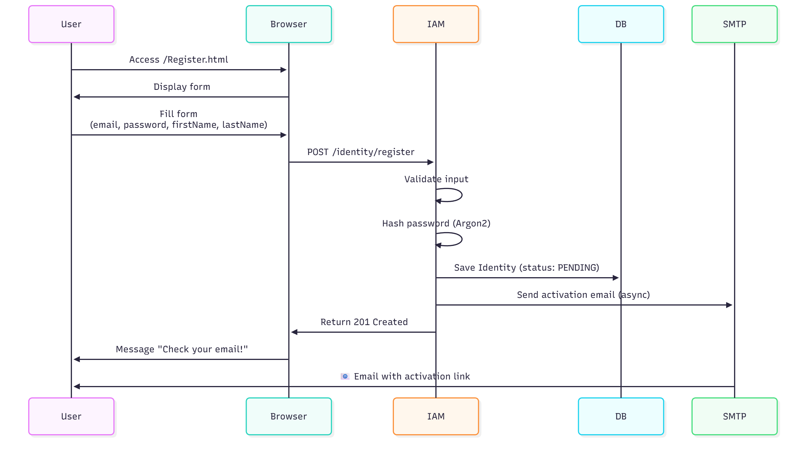
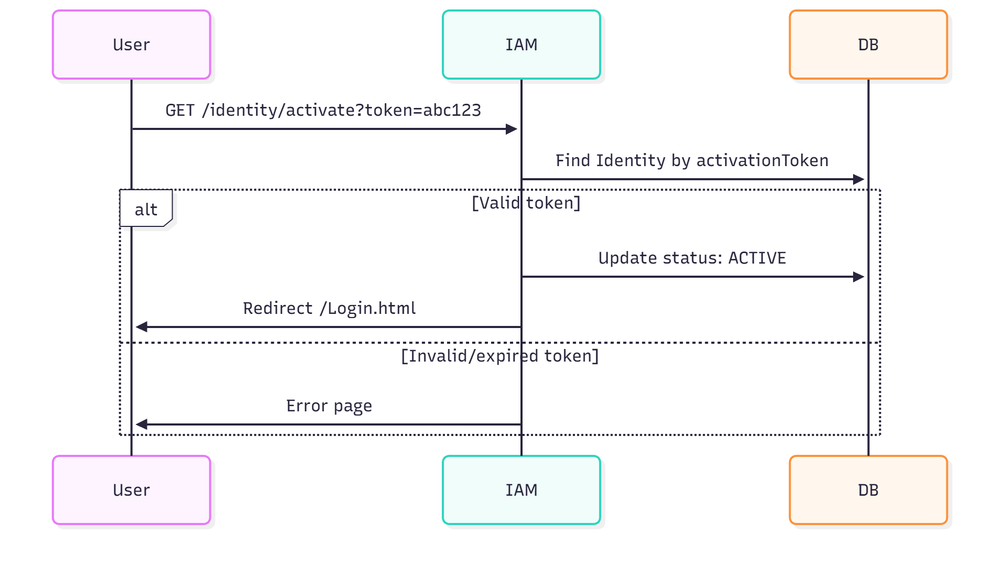

# 🔐 Smart Greenhouse IAM (Identity and Access Management)

## 📋 Table of Contents

- [Overview](#-overview)
- [OAuth2 / OpenID Connect Architecture](#-oauth2--openid-connect-architecture)
- [Technologies and Dependencies](#-technologies-and-dependencies)
- [Installation and Configuration](#-installation-and-configuration)
- [Authentication Flows](#-authentication-flows)
- [API Endpoints](#-api-endpoints)
- [Security and Encryption](#-security-and-encryption)
- [Database](#-database)
- [HTML Pages](#-html-pages)
- [Testing](#-testing)
- [Deployment](#-deployment)
- [Integration with API](#-integration-with-api)

---

## 🎯 Overview

The **IAM** (Identity and Access Management) module is the authentication and authorization system for Smart Greenhouse. It implements **OAuth2** and **OpenID Connect** standards to provide:

- 🔑 **Secure Authentication**: Login with email/password
- 📝 **User Management**: Registration, email activation
- 🏢 **Multi-tenant Management**: Support for multiple organizations
- 🎫 **JWT Tokens**: Issuance of JSON Web Tokens for API
- 🔄 **OAuth2 Authorization Code Flow**: Standard authentication flow

### Main Features

- ✅ User registration with email validation
- ✅ One-click account activation
- ✅ OAuth2 authentication with Authorization Code Flow
- ✅ JWT generation (Access Token + ID Token)
- ✅ Tenant management (multi-organization)
- ✅ Secure password hashing with Argon2
- ✅ Role support (Client, Admin)
- ✅ Email integration with SMTP (Gmail)

---

## 🏗️ OAuth2 / OpenID Connect Architecture

### Complete Authentication Flow



### Layered Architecture

```
iam/
├── boundaries/              # REST Endpoints (JAX-RS)
│   ├── OAuthAuthorizationEndpoint      # /oauth/authorize
│   ├── OAuthTokenEndpoint              # /oauth/token
│   ├── IdentityRegistrationEndpoint    # /identity/register
│   ├── IdentityManagementEndpoint      # /identity/activate
│   ├── TenantManagementEndpoint        # /tenants
│   └── JwkEndpoint                     # /jwks (JWT public keys)
├── controllers/
│   ├── managers/            # Business logic
│   │   ├── IdentityManager
│   │   ├── TenantManager
│   │   ├── JwtManager
│   │   └── EmailManager
│   └── repositories/        # Data access (JNoSQL)
│       ├── IdentityRepository
│       └── TenantRepository
├── entities/
│   ├── Identity.java        # User entity
│   └── Tenant.java          # Organization entity
├── security/
│   ├── AuthorizationCode.java
│   ├── Argon2Hasher.java
│   └── JwtUtil.java
└── webapp/
    ├── Register.html        # Registration form
    ├── Activate.html        # Activation confirmation page
    └── Login.html           # Login form
```

---

## 🛠️ Technologies and Dependencies

### Frameworks and APIs

| Technology | Version | Description |
|------------|---------|-------------|
| **Jakarta EE** | 10.0.0 | Enterprise application platform |
| **JAX-RS** | Included | REST API |
| **CDI** | Included | Dependency injection |
| **Jakarta Mail** | 2.1.0 | Email sending |

### Security and Cryptography

| Technology | Version | Description |
|------------|---------|-------------|
| **Argon2-JVM** | 2.11 | Password hashing (Password Hashing Competition winner) |
| **JSON Web Token (JWT)** | Native | Token generation and validation |

### Database

| Technology | Version | Description |
|------------|---------|-------------|
| **Eclipse JNoSQL MongoDB** | 1.0.3 | NoSQL abstraction |
| **MongoDB** | 8.0+ compatible | User and tenant storage |

### Utilities

| Technology | Version | Description |
|------------|---------|-------------|
| **Apache Commons Lang3** | 3.17.0 | Java utilities |
| **JSON** | 20240303 | JSON manipulation |
| **Eclipse Angus Jakarta Mail** | 1.0.0 | Jakarta Mail implementation |
| **Yasson** | 3.0.3 | JSON-B implementation |

### Testing

| Technology | Version | Description |
|------------|---------|-------------|
| **JUnit 5** | 5.11.0 | Unit testing framework |
| **Mockito** | 5.5.0 | Mocking framework |
| **SmallRye Config** | 3.5.2 | MicroProfile Config implementation for tests |

### Application Server

- **WildFly** 37+ (with Jakarta EE 10 support)
- **Java** 21

---

## 📦 Installation and Configuration

### Prerequisites

1. **Java Development Kit (JDK) 21**
2. **Apache Maven 3.9+**
3. **MongoDB 8.0+** (same instance as API)
4. **Gmail Account** (for sending emails via SMTP)
5. **WildFly 37+**

### Installation Steps

#### 1. Email Configuration (Gmail SMTP)

To enable sending activation emails, configure a Gmail account:

**Generate a Google App Password**:
1. Go to https://myaccount.google.com/security
2. Enable 2-step verification
3. Go to "App passwords"
4. Generate a password for "Mail"
5. Copy the generated password (e.g., `toyg luxx ljzt zjpm`)

#### 2. Configuration File

Edit `src/main/resources/META-INF/microprofile-config.properties`:

```properties
# MongoDB Configuration
jnosql.document.database=CoT_Project
jnosql.mongodb.host=localhost:27017
jnosql.document.provider=org.eclipse.jnosql.databases.mongodb.communication.MongoDBDocumentConfiguration

# Argon2 Password Hashing Configuration
argon2.saltLength=32
argon2.hashLength=128
argon2.iterations=23
argon2.memory=97579
argon2.threadNumber=2

# JWT Configuration
key.pair.lifetime.duration=10800        # 3 hours (in seconds)
key.pair.cache.size=3
jwt.lifetime.duration=10800             # 3 hours
jwt.issuer=urn:me.greenhouse.iam
jwt.claim.roles=groups
jwt.realm=urn:phoenix.xyz:iam

# Email Service Configuration
smtp.host=smtp.gmail.com
smtp.port=587
smtp.username=YOUR_EMAIL@gmail.com
smtp.password=YOUR_APP_PASSWORD
smtp.starttls.enable=true

# Available Roles
roles=Client,Admin
```

#### 3. OAuth2 Client Configuration

The `smartgreenhouse` client is the default OAuth2 client for the PWA.

**Parameters**:
- **Client ID**: `smartgreenhouse`
- **Redirect URI**: `http://localhost:8000/callback-oauth.html`
- **Response Type**: `code` (Authorization Code Flow)
- **Grant Type**: `authorization_code`

> ⚠️ **Security**: In production, use HTTPS and configure strict redirect URIs.

#### 4. Compilation and Deployment

```bash
# Compile
cd "c:\Users\marwe\Desktop\Nouveau dossier (4)\iam"
mvn clean package

# Deploy on WildFly
copy target\iam-1.0.war %WILDFLY_HOME%\standalone\deployments\

# Or with Maven
mvn wildfly:deploy
```

#### 5. Verification

IAM will be accessible at:
- **Base URL**: http://localhost:8080/iam-1.0/rest-iam
- **Registration page**: http://localhost:8080/iam-1.0/Register.html
- **Login page**: http://localhost:8080/iam-1.0/Login.html
- **OAuth Authorize**: http://localhost:8080/iam-1.0/rest-iam/oauth/authorize

---

## 🔄 Authentication Flows

### 1. New User Registration



**Example request**:

```http
POST /rest-iam/identity/register
Content-Type: application/json

{
  "email": "user@example.com",
  "password": "SecureP@ssw0rd",
  "firstName": "John",
  "lastName": "Doe",
  "tenantId": "default"
}
```

### 2. Account Activation

**Activation link in email**:
```
http://localhost:8080/iam-1.0/rest-iam/identity/activate?token=abc123def456
```



### 3. OAuth2 Login (Authorization Code Flow)

#### Step 1: Authorization

```http
GET /rest-iam/oauth/authorize?
    client_id=smartgreenhouse&
    redirect_uri=http://localhost:8000/callback-oauth.html&
    response_type=code&
    scope=openid profile
```

**Response**: Redirects to `/Login.html` if not authenticated

#### Step 2: Login

User enters credentials on `/Login.html`:

```html
<form action="/rest-iam/oauth/authorize" method="POST">
  <input type="email" name="username" />
  <input type="password" name="password" />
  <input type="hidden" name="client_id" value="smartgreenhouse" />
  <input type="hidden" name="redirect_uri" value="http://localhost:8000/callback-oauth.html" />
  <button type="submit">Login</button>
</form>
```

**Response on success**:
```http
HTTP/1.1 302 Found
Location: http://localhost:8000/callback-oauth.html?code=eyJhbGc...
```

#### Step 3: Exchange Code for Token

```http
POST /rest-iam/oauth/token
Content-Type: application/x-www-form-urlencoded

grant_type=authorization_code&
code=eyJhbGc...&
client_id=smartgreenhouse&
redirect_uri=http://localhost:8000/callback-oauth.html
```

**Response 200 OK**:
```json
{
  "access_token": "eyJhbGciOiJSUzI1NiIsInR5cCI6IkpXVCJ9...",
  "token_type": "Bearer",
  "expires_in": 10800,
  "id_token": "eyJhbGciOiJSUzI1NiIsInR5cCI6IkpXVCJ9...",
  "scope": "openid profile"
}
```

**HttpOnly Cookie**:
```
Set-Cookie: access_token=eyJhbGc...; HttpOnly; SameSite=Lax; Path=/
```

---

## 🔌 API Endpoints

### Base URL

```
http://localhost:8080/iam-1.0/rest-iam
```

### 📝 Registration Endpoints

#### 1. Register New User

```http
POST /identity/register
Content-Type: application/json
```

**Body**:
```json
{
  "email": "user@example.com",
  "password": "SecurePassword123!",
  "firstName": "John",
  "lastName": "Doe",
  "tenantId": "default"
}
```

**Response 201 Created**:
```json
{
  "message": "User registered successfully. Please check your email to activate your account."
}
```

#### 2. Activate Account

```http
GET /identity/activate?token={activationToken}
```

**Parameters**:
- `token`: Activation token sent via email

**Response 302 Found**: Redirects to `/Login.html`

### 🔐 OAuth2 Endpoints

#### 1. Authorization Endpoint

```http
GET /oauth/authorize?client_id={clientId}&redirect_uri={redirectUri}&response_type=code&scope={scope}
```

**Parameters**:
- `client_id`: OAuth2 client ID (e.g., `smartgreenhouse`)
- `redirect_uri`: Redirect URI after authentication
- `response_type`: Always `code` (Authorization Code Flow)
- `scope`: Requested scopes (e.g., `openid profile`)

**Response**:
- If not authenticated: Displays `/Login.html`
- If authenticated: Redirects to `{redirect_uri}?code={authorization_code}`

#### 2. Token Endpoint

```http
POST /oauth/token
Content-Type: application/x-www-form-urlencoded
```

**Body**:
```
grant_type=authorization_code&
code={authorization_code}&
client_id={client_id}&
redirect_uri={redirect_uri}
```

**Response 200 OK**:
```json
{
  "access_token": "eyJhbGciOiJSUzI1NiIsInR5cCI6IkpXVCJ9...",
  "token_type": "Bearer",
  "expires_in": 10800,
  "id_token": "eyJhbGciOiJSUzI1NiIsInR5cCI6IkpXVCJ9...",
  "scope": "openid profile"
}
```

#### 3. JWK Endpoint (Public Keys)

```http
GET /jwks
```

**Response 200 OK**:
```json
{
  "keys": [
    {
      "kty": "RSA",
      "e": "AQAB",
      "n": "xGOr-H7A...",
      "alg": "RS256",
      "use": "sig",
      "kid": "key-2025-12-01"
    }
  ]
}
```

### 🏢 Tenant Management Endpoints

#### 1. Create Tenant

```http
POST /tenants
Content-Type: application/json
Authorization: Bearer {admin_jwt}
```

**Body**:
```json
{
  "name": "My Organization",
  "domain": "myorg.com",
  "adminEmail": "admin@myorg.com"
}
```

#### 2. List All Tenants

```http
GET /tenants
Authorization: Bearer {admin_jwt}
```

**Response 200 OK**:
```json
[
  {
    "id": "default",
    "name": "Default Tenant",
    "domain": "greenhouse.local",
    "createdAt": "2025-11-25T10:00:00Z"
  }
]
```

---

## 🔒 Security and Encryption

### Password Hashing (Argon2)

The IAM module uses **Argon2id**, the winner of the Password Hashing Competition, to secure passwords.

**Argon2 Parameters**:
```properties
argon2.saltLength=32          # 256 bits random salt
argon2.hashLength=128         # 1024 bits hash
argon2.iterations=23          # Number of iterations
argon2.memory=97579          # ~95 MB memory
argon2.threadNumber=2         # 2 parallel threads
```

**Argon2 Advantages**:
- ✅ Resistance to dictionary attacks
- ✅ Resistance to GPU/ASIC attacks
- ✅ Protection against timing attacks
- ✅ Configurable to balance security/performance

### JWT Generation

**Access Token Structure**:

```json
{
  "header": {
    "alg": "RS256",
    "typ": "JWT",
    "kid": "key-2025-12-01"
  },
  "payload": {
    "sub": "user@example.com",
    "iss": "urn:me.greenhouse.iam",
    "aud": "smartgreenhouse",
    "exp": 1733087415,
    "iat": 1733076615,
    "groups": ["Client"],
    "email": "user@example.com",
    "name": "John Doe",
    "tenant": "default"
  },
  "signature": "..."
}
```

**Algorithm**:
- **RS256**: RSA Signature with SHA-256
- **Key pair**: Dynamically generated at startup
- **Key rotation**: Cache of maximum 3 key pairs
- **Lifetime**: 3 hours (10800 seconds)

### Token Validation

The API validates JWTs by:
1. Verifying signature with public key (retrieved via `/jwks`)
2. Verifying expiration (`exp` claim)
3. Verifying issuer (`iss` claim)
4. Verifying audience (`aud` claim)

---

## 💾 Database

### MongoDB - Collection Structure

#### Collection: `Identity`

```javascript
{
  "_id": ObjectId("674c123abc456def78901234"),
  "email": "user@example.com",
  "passwordHash": "$argon2id$v=19$m=97579,t=23,p=2$...",
  "firstName": "John",
  "lastName": "Doe",
  "roles": ["Client"],
  "tenant": "default",
  "status": "ACTIVE",           // PENDING | ACTIVE | SUSPENDED
  "activationToken": null,       // Token for activation (null after activation)
  "createdAt": ISODate("2025-11-25T10:00:00Z"),
  "lastLogin": ISODate("2025-12-01T20:30:00Z")
}
```

**Possible statuses**:
- `PENDING`: Awaiting email activation
- `ACTIVE`: Account activated and usable
- `SUSPENDED`: Account suspended (by admin)

#### Collection: `Tenant`

```javascript
{
  "_id": "default",
  "name": "Default Tenant",
  "domain": "greenhouse.local",
  "adminEmail": "admin@greenhouse.local",
  "createdAt": ISODate("2025-11-25T09:00:00Z"),
  "settings": {
    "allowRegistration": true,
    "requireEmailActivation": true
  }
}
```

### Recommended Indexing

```javascript
// Unique index on email to prevent duplicates
db.Identity.createIndex({ "email": 1 }, { unique: true })

// Index on activationToken for fast lookup
db.Identity.createIndex({ "activationToken": 1 }, { sparse: true })

// Index on tenant for multi-tenant queries
db.Identity.createIndex({ "tenant": 1 })
```

---

## 🌐 HTML Pages

### 1. Register.html

**Features**:
- Registration form with client-side validation
- Fields: Email, Password, First Name, Last Name
- Password strength validation
- Error/success message display
- Modern design with glassmorphism

**Excerpt**:
```html
<form id="registerForm">
  <input type="email" name="email" required placeholder="Email" />
  <input type="password" name="password" required placeholder="Password" />
  <input type="text" name="firstName" required placeholder="First Name" />
  <input type="text" name="lastName" required placeholder="Last Name" />
  <button type="submit">Sign Up</button>
</form>

<script>
  document.getElementById('registerForm').addEventListener('submit', async (e) => {
    e.preventDefault();
    const formData = new FormData(e.target);
    const data = {
      email: formData.get('email'),
      password: formData.get('password'),
      firstName: formData.get('firstName'),
      lastName: formData.get('lastName'),
      tenantId: 'default'
    };
    
    const response = await fetch('/iam-1.0/rest-iam/identity/register', {
      method: 'POST',
      headers: { 'Content-Type': 'application/json' },
      body: JSON.stringify(data)
    });
    
    if (response.ok) {
      alert('Registration successful! Please check your email.');
    }
  });
</script>
```

### 2. Login.html

**Features**:
- OAuth2 login form
- Redirect parameter handling
- Login error display
- Link to registration page

**Access URL**:
```
http://localhost:8080/iam-1.0/Login.html?
  client_id=smartgreenhouse&
  redirect_uri=http://localhost:8000/callback-oauth.html
```

### 3. Activate.html

**Features**:
- Activation confirmation page
- Success message
- Automatic redirect to Login
- Consistent design with application

---

## 🧪 Testing

### Running Tests

```bash
# Run all tests
mvn test

# Run specific test
mvn test -Dtest=IdentityManagerTest
```

### Test Structure

```
src/test/java/com/greenhouse/
├── controllers/
│   └── managers/
│       ├── IdentityManagerTest.java
│       ├── TenantManagerTest.java
│       └── JwtManagerTest.java
```

---

## 🚀 Deployment

### Multi-Environment Configuration

**Development**:
```properties
iam.base.url=http://localhost:8080/iam-1.0
oauth.redirect.uri=http://localhost:8000/callback-oauth.html
```

**Production**:
```properties
iam.base.url=https://iam.greenhouse.com
oauth.redirect.uri=https://app.greenhouse.com/callback-oauth.html
smtp.host=smtp.sendgrid.net  # Professional email service
```

### Docker Deployment

```dockerfile
FROM quay.io/wildfly/wildfly:37.0.0.Final-jdk21

COPY target/iam-1.0.war /opt/wildfly/standalone/deployments/

EXPOSE 8080

CMD ["/opt/wildfly/bin/standalone.sh", "-b", "0.0.0.0"]
```

---

## 🔗 Integration with API

### API Configuration

The API must know the IAM URL to validate JWTs:

**In `api/src/main/resources/META-INF/microprofile-config.properties`**:
```properties
iam.url=http://localhost:8080/iam-1.0/rest-iam
```

### JWT Validation in API

```java
@Provider
public class JWTAuthenticationFilter implements ContainerRequestFilter {
    
    @Inject
    @ConfigProperty(name = "iam.url")
    String iamUrl;
    
    @Override
    public void filter(ContainerRequestContext requestContext) {
        // 1. Get JWT from cookie
        Cookie jwtCookie = requestContext.getCookies().get("access_token");
        
        // 2. Retrieve public key from IAM
        JsonObject jwks = fetchJwks(iamUrl + "/jwks");
        
        // 3. Validate JWT signature
        if (!validateJwtSignature(jwtCookie.getValue(), jwks)) {
            requestContext.abortWith(Response.status(401).build());
        }
    }
}
```

---

## 📝 Release Notes

### v1.0 - Current Features

- ✅ User registration with email validation
- ✅ One-click activation
- ✅ OAuth2 authentication (Authorization Code Flow)
- ✅ JWT generation (RS256)
- ✅ Multi-tenant management
- ✅ Argon2 secure hashing
- ✅ Asynchronous email sending
- ✅ Modern HTML pages

### Future Improvements

- 🔄 Password reset via email
- 🔄 OAuth2 Refresh Token
- 🔄 OAuth2 PKCE support for PWA
- 🔄 2FA (Two-Factor Authentication)
- 🔄 SSO (Single Sign-On) with SAML
- 🔄 Login audit logs
- 🔄 Fine-grained permissions (RBAC)

---

## 📄 License

This project is developed as part of an academic Smart Greenhouse project.
