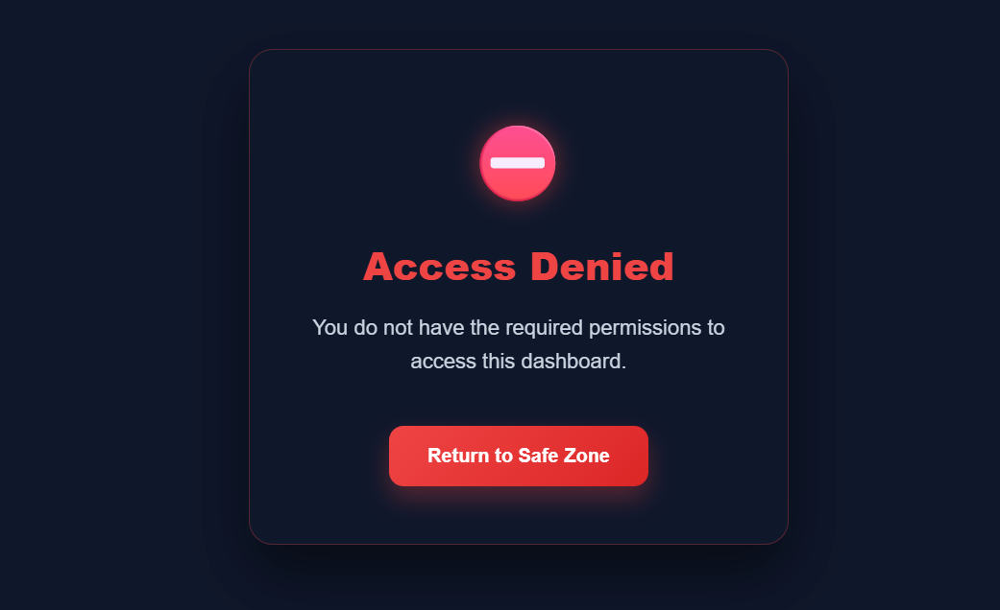
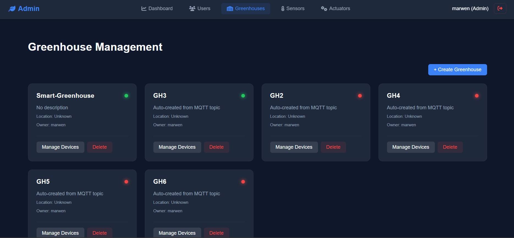
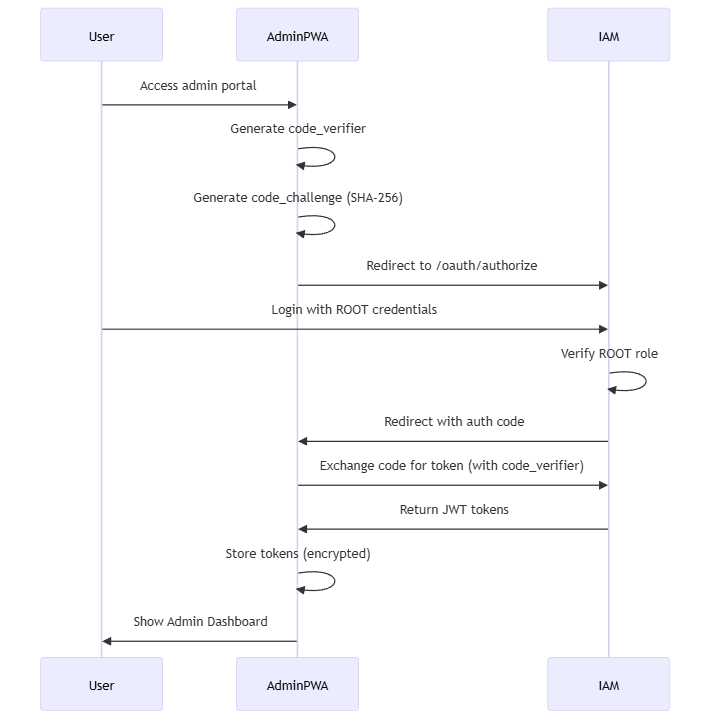

# 🔐 Smart Greenhouse Admin PWA (Progressive Web Application)

## 📋 Table of Contents

- [Overview](#-overview)
- [Features](#-features)
- [Access Requirements](#-access-requirements)
- [Technologies](#-technologies)
- [Installation and Configuration](#-installation-and-configuration)
- [User Management](#-user-management)
- [Greenhouse Management](#-greenhouse-management)
- [Device Management](#-device-management)
- [Authentication](#-authentication)
- [PWA Features](#-pwa-features)
- [Deployment](#-deployment)

---

## 🎯 Overview

The **Admin PWA** is the administrative interface for the Smart Greenhouse system. It provides centralized management capabilities for:

- 👥 **User Management**: Assign users to greenhouses and manage access
- 🏢 **Greenhouse Management**: Create, configure, and manage greenhouses
- 📡 **Device Provisioning**: Attach and configure sensors and actuators
- 📊 **System Monitoring**: View statistics and system overview

### Screenshots


*ROOT Role Required for Admin Access*


*Greenhouse and Device Management Interface*

> **⚠️ IMPORTANT**: This application requires **ROOT role** access. Only administrators with the ROOT role (value: `9223372036854775807`) can access this portal.

---

## 🌟 Features

### 1. User Management

- **View All Users**: Display all registered users with their email addresses
- **Greenhouse Assignment**: Assign/unassign users to specific greenhouses using checkbox modal
- **Bulk Operations**: Manage multiple greenhouse assignments simultaneously

### 2. Greenhouse Management

- **Create Greenhouses**: Add new greenhouses to the system
- **View Details**: Access comprehensive greenhouse information
- **Device Management**: View and manage attached sensors and actuators
- **Delete Greenhouses**: Remove greenhouses from the system

### 3. Device Management

**Sensors**:
- View all sensors in the system
- Filter by greenhouse
- See real-time values and status
- Attach/detach from greenhouses

**Actuators**:
- View all actuators
- Filter by greenhouse  
- Monitor device states
- Attach/detach from greenhouses

### 4. Dashboard

Real-time statistics display:
- Total users count
- Total greenhouses count
- Total sensors count
- Total actuators count

---

## 🔒 Access Requirements

### ROOT Role Requirement

Access to the Admin PWA is **RESTRICTED** to users with the **ROOT role**.

#### Role Details

```javascript
{
  "_id": "47766533-9bb3-4830-b9be-d9a1837825ed",
  "username": "marwen",
  "email": "marwen.bellili@supcom.tn",
  "role": 9223372036854775807,  // ROOT (Long.MAX_VALUE)
  "isAccountActivated": true,
  "scopes": "resource:read resource:write"
}
```

**Role Value**: `9223372036854775807` (Long.MAX_VALUE)

#### Verification in IAM

The IAM service verifies ROOT role using exact match:

```java
// From Smart-Greenhouse-iam_v2/Role.java
public enum Role {
    // ... other roles ...
    ROOT(Long.MAX_VALUE);  // 9223372036854775807
}
```

**Access Control**:
```java
// Exact match required for ROOT
if (roles.equals(Role.ROOT.getValue())) {
    ret.add(Role.ROOT.name().toLowerCase());
    return ret;
}
```

> **📌 Note**: Regular users (non-ROOT) will see an "Access Denied" screen when attempting to access the Admin PWA.

---

## 🛠️ Technologies

### Frontend Technologies

| Technology | Description |
|------------|-------------|
| **Vanilla JavaScript** | ES6 modules for clean architecture |
| **HTML5** | Semantic markup |
| **CSS3** | Modern styling with glassmorphism |
| **Font Awesome 6.0** | Icon library |

### PWA Technologies

| Feature | Technology |
|---------|-----------|
| **Service Worker** | Offline caching and functionality |
| **Web App Manifest** | PWA configuration and installability |
| **Favicon Support** | Multi-size icons for all platforms |

### Architecture

```
pwa-admin/
├── index.html              # Main application page
├── manifest.json           # PWA manifest
├── sw.js                   # Service Worker
├── css/
│   ├── style.css           # Main styles
│   ├── loading.css         # Loading animations
│   ├── modal.css          # Modal dialogs
│   ├── filters.css        # Filter components
│   └── welcome.css        # Welcome page styles
├── js/
│   ├── init.js            # Application initialization
│   ├── admin.js           # Main admin logic
│   ├── auth.js            # Authentication manager
│   ├── config.js          # API configuration
│   ├── iam-service.js     # IAM API client
│   ├── greenhouse-service.js  # Greenhouse API client
│   ├── sensor-service.js  # Sensor API client
│   ├── actuator-service.js    # Actuator API client
│   └── secure-storage.js  # Encrypted token storage
├── pages/
│   └── welcome.html       # Landing page
├── icons/                 # PWA icons (16x16 to 512x512)
├── images/                # Documentation images
└── server.py             # Development server
```

---

## 📦 Installation and Configuration

### Prerequisites

1. **Web Browser** (Chrome, Firefox, Edge, Safari)
2. **Backend Services** running:
   - API Module (http://localhost:8080/smartgreenhouse)
   - IAM Module (http://localhost:8080/iam-1.0)
3. **ROOT Role User** account in IAM database

### Installation Steps

#### 1. Clone the Project

```bash
git clone https://github.com/defk0n1/Smart-Greenhouse.git
cd smart-greenhouse/pwa-admin
```

#### 2. Configuration

Edit `js/config.js`:

```javascript
export const API_CONFIG = {
    // API Endpoints
    API_BASE_URL: window.location.hostname === 'localhost'
        ? 'http://localhost:8080/smartgreenhouse/rest'
        : window.location.origin + '/smartgreenhouse/rest',
    
    // IAM Endpoints
    IAM_BASE_URL: 'http://localhost:8080/iam-1.0/rest-iam',
    IAM_AUTHORIZE_URL: 'http://localhost:8080/iam-1.0/rest-iam/oauth/authorize',
    IAM_TOKEN_URL: 'http://localhost:8080/iam-1.0/rest-iam/oauth/token',
    
    // OAuth2 Configuration
    CLIENT_ID: 'smartgreenhouse-admin',
    REDIRECT_URI: 'http://localhost:8001/index.html',
    
    // Security
    AUTH_REQUIRED: true,
    PKCE_ENABLED: true  // SHA-256 code challenge
};
```

#### 3. Start Development Server

**Python Server (Recommended)**:

```bash
python server.py
```

The server will start on port **8001** by default.

**Alternative - Node.js**:

```bash
npm install -g http-server
http-server -p 8001 --cors
```

#### 4. Access Application

Open browser and navigate to:
- **Local**: http://localhost:8001
- **Network**: http://[YOUR_IP]:8001

### First Launch

1. Application redirects to IAM login page
2. **Login with ROOT role account**:
   - Username: `marwen` (or your ROOT user)
   - Password: [your password]
3. After successful authentication, you'll be redirected to Admin Dashboard
4. If your user does NOT have ROOT role, you'll see "Access Denied" screen

---

## 👥 User Management

### Viewing Users

The **Users** view displays all registered users:

```
| USERNAME | EMAIL                         | ACTIONS    |
|----------|-------------------------------|------------|
| marwen   | marwen.bellili@supcom.tn     | Assign GH  |
| user1    | user1@example.com            | Assign GH  |
```

### Assigning Greenhouses

1. Click **"Assign GH"** button for a user
2. Modal opens showing all available greenhouses
3. **Check/Uncheck** greenhouses to assign/unassign
4. Click **"Save Changes"**
5. System updates all assignments in parallel

**Features**:
- ✅ Checkbox-based multi-selection
- ✅ Shows current assignments (pre-checked)
- ✅ Batch assignment/unassignment
- ✅ Real-time updates

---

## 🏢 Greenhouse Management

### Creating Greenhouses

1. Navigate to **Greenhouses** view
2. Click **"+ Create Greenhouse"**
3. Enter greenhouse name
4. New greenhouse is created with default settings

### Managing Devices

1. Click **"Manage Devices"** on a greenhouse card
2. View attached sensors and actuators
3. **Attach new devices**:
   - Select device from dropdown (only shows unassigned devices)
   - Click "Attach" button
4. **Detach devices**:
   - Click "Detach" button next to device
   - Confirm removal

**Important**: The system prevents assigning a device to multiple greenhouses. Devices already attached to ANY greenhouse will not appear in the available devices list.

### Deleting Greenhouses

1. Click **"Delete"** button on greenhouse card
2. Confirm deletion
3. Greenhouse and all associations are removed

---

## 📡 Device Management

### Sensors View

View and filter all sensors:

```
| ID    | TYPE          | VALUE      | GREENHOUSE |
|-------|---------------|------------|------------|
| temp1 | temperature   | 26.20 °C   | GH6        |
| hum1  | humidity      | 57.80 %    | GH4        |
```

**Features**:
- Filter by greenhouse
- Real-time value display
- Status indicators

### Actuators View

Monitor all actuators:

```
| ID      | TYPE    | STATE   | GREENHOUSE |
|---------|---------|---------|------------|
| fan1    | fan     | UNKNOWN | GH4        |
| pump1   | pump    | UNKNOWN | GH6        |
```

**Features**:
- Filter by greenhouse
- State monitoring
- Type identification

---

## 🔐 Authentication

### OAuth2 Flow with PKCE

The Admin PWA uses **OAuth2 Authorization Code Flow** with **PKCE** (Proof Key for Code Exchange):


*OAuth2 Authorization Code Flow with PKCE for Admin PWA*

### Authentication Manager

Located in `js/auth.js`:

```javascript
export const authManager = {
    async checkAuth() {
        // Verify ROOT role access
        const response = await fetch(`${IAM_BASE_URL}/me`, {
            credentials: 'include'
        });
        
        if (!response.ok) {
            this.redirectToLogin();
            return false;
        }
        
        const user = await response.json();
        
        // CRITICAL: Check ROOT role
        if (user.role !== 9223372036854775807) {
            window.location.href = 'pages/access-denied.html';
            return false;
        }
        
        return true;
    },
    
    logout() {
        secureStorage.clear();
        window.location.href = IAM_BASE_URL + '/logout';
    }
};
```

### Secure Token Storage

Tokens are encrypted using `secure-storage.js`:

```javascript
import { SecureStorage } from './secure-storage.js';

const secureStorage = new SecureStorage();

// Store encrypted
secureStorage.setItem('access_token', token);

// Retrieve and decrypt
const token = secureStorage.getItem('access_token');
```

---

## 📱 PWA Features

### Installability

The Admin PWA is fully installable on all platforms:

**Desktop (Chrome/Edge)**:
1. Look for install icon (⊕) in address bar
2. Click to install
3. App opens in standalone window

**Mobile (Android)**:
1. Open in Chrome
2. Tap menu → "Add to Home screen"
3. App icon appears on home screen

**iOS (Safari)**:
1. Tap Share button
2. Select "Add to Home Screen"
3. App installs with custom icon

### Offline Support

Service Worker (`sw.js`) provides offline functionality:

```javascript
const CACHE_NAME = 'admin-pwa-v1';
const ASSETS = [
    './',
    './index.html',
    './css/style.css',
    './js/init.js',
    './js/admin.js',
    './pages/welcome.html'
];

// Cache on install
self.addEventListener('install', (e) => {
    e.waitUntil(
        caches.open(CACHE_NAME).then(cache => cache.addAll(ASSETS))
    );
});

// Network-first strategy
self.addEventListener('fetch', (e) => {
    e.respondWith(
        fetch(e.request)
            .catch(() => caches.match(e.request))
    );
});
```

### Manifest Configuration

`manifest.json`:

```json
{
    "name": "Smart Greenhouse Admin",
    "short_name": "Admin",
    "start_url": "./index.html",
    "display": "standalone",
    "background_color": "#0f172a",
    "theme_color": "#3b82f6",
    "icons": [
        {
            "src": "icons/icon-192x192.png",
            "sizes": "192x192",
            "type": "image/png",
            "purpose": "any maskable"
        },
        {
            "src": "icons/icon-512x512.png",
            "sizes": "512x512",
            "type": "image/png",
            "purpose": "any maskable"
        }
    ]
}
```

---

## 🚀 Deployment

### Production Configuration

Update `js/config.js` for production:

```javascript
export const API_CONFIG = {
    API_BASE_URL: 'https://api.greenhouse.com/smartgreenhouse/rest',
    IAM_BASE_URL: 'https://iam.greenhouse.com/iam-1.0/rest-iam',
    IAM_AUTHORIZE_URL: 'https://iam.greenhouse.com/iam-1.0/rest-iam/oauth/authorize',
    IAM_TOKEN_URL: 'https://iam.greenhouse.com/iam-1.0/rest-iam/oauth/token',
    CLIENT_ID: 'smartgreenhouse-admin',
    REDIRECT_URI: 'https://admin.greenhouse.com/index.html',
    AUTH_REQUIRED: true,
    PKCE_ENABLED: true
};
```

### Deployment Options

**Option A: Netlify**

```bash
npm install -g netlify-cli
netlify deploy --prod
```

**Option B: Vercel**

```bash
npm install -g vercel
vercel --prod
```

**Option C: GitHub Pages**

```bash
git checkout -b gh-pages
git push origin gh-pages
```

### Production Checklist

- ✅ HTTPS enabled (required for PWA)
- ✅ Service Worker registered
- ✅ Manifest validated
- ✅ ROOT role verification active
- ✅ API URLs updated
- ✅ OAuth redirect URIs configured
- ✅ CORS enabled on backend
- ✅ Icons optimized

---

## 🔧 API Endpoints

### IAM Service

```
POST   /oauth/authorize          - OAuth2 authorization
POST   /oauth/token              - Token exchange
GET    /me                       - Current user info (with role)
POST   /logout                   - Logout
```

### User Management

```
GET    /iam/users                - List all users
GET    /iam/users/{id}           - Get user details
PUT    /iam/users/{id}/status    - Update user status
```

### Greenhouse Management

```
GET    /greenhouses              - List all greenhouses
POST   /greenhouses              - Create greenhouse
GET    /greenhouses/{id}         - Get greenhouse details
DELETE /greenhouses/{id}         - Delete greenhouse
POST   /greenhouses/{id}/sensors/{sensorId}      - Attach sensor
DELETE /greenhouses/{id}/sensors/{sensorId}      - Detach sensor
POST   /greenhouses/{id}/actuators/{actuatorId}  - Attach actuator
DELETE /greenhouses/{id}/actuators/{actuatorId}  - Detach actuator
POST   /greenhouses/{id}/users/{username}        - Assign user
DELETE /greenhouses/{id}/users/{username}        - Remove user
```

### Sensor/Actuator Management

```
GET    /sensors                  - List all sensors
GET    /sensors/{id}             - Get sensor details
GET    /actuators                - List all actuators
GET    /actuators/{id}           - Get actuator details
```

---

## 📝 Release Notes

### v1.0 - Current Features

- ✅ User management with greenhouse assignment
- ✅ Greenhouse creation and configuration
- ✅ Device provisioning (sensors/actuators)
- ✅ Dashboard with system statistics
- ✅ ROOT role access control
- ✅ OAuth2 with PKCE security
- ✅ Service Worker offline support
- ✅ PWA installability
- ✅ Responsive design
- ✅ Encrypted token storage

### Future Improvements

- 🔄 User creation and role management
- 🔄 Bulk device operations
- 🔄 System logs and audit trail
- 🔄 Advanced filtering and search
- 🔄 Export data to CSV/PDF
- 🔄 Real-time notifications
- 🔄 Multi-language support

---

## 📄 License

This project is developed as part of an academic Smart Greenhouse project.

---

## 🆘 Troubleshooting

### Access Denied

**Problem**: "Access Denied" screen appears after login

**Solution**: Verify your user has ROOT role:
```sql
-- Check role in database
SELECT username, role FROM users WHERE username = 'your_username';
-- Should return: role = 9223372036854775807
```

### OAuth Redirect Issues

**Problem**: Stuck in redirect loop

**Solution**: 
1. Clear browser cookies
2. Verify `REDIRECT_URI` matches exactly in config and IAM
3. Check CORS configuration on backend

### Devices Not Appearing

**Problem**: Sensors/actuators don't show in dropdown

**Solution**: Device might already be assigned to another greenhouse. Check "All Sensors" / "All Actuators" view to see current assignments.

---

**🌱 Happy Administrating!**
