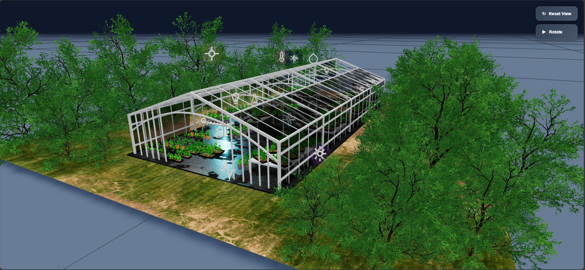
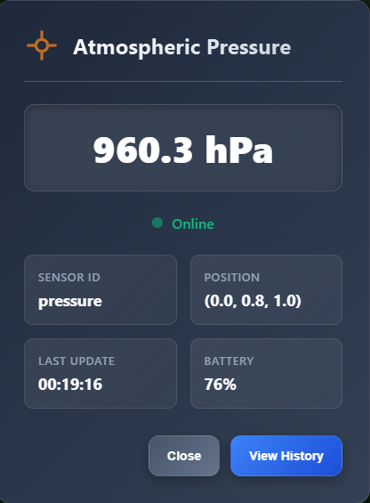

# Greenhouse 3D Viewer PWA

An interactive Progressive Web App (PWA) for 3D visualization of a sensor-equipped greenhouse. This application allows real-time monitoring of temperature, humidity, and other environmental sensor data in an immersive 3D interface.


*Figure 1: Interactive 3D Greenhouse Visualization*


*Figure 2: Detailed view when clicking on the atmospheric pressure sensor*

## Features

- Interactive 3D greenhouse visualization
- Real-time sensor data display
- Scalable charts for trend analysis
- Responsive and adaptive user interface
- Native app installation (PWA)
- Offline mode with Service Worker

## Technologies Used

- **Three.js** for 3D rendering
- **Chart.js** for data visualization
- **Service Workers** for offline functionality
- **Web App Manifest** for native installation
- **IndexedDB** for local data storage

## Project Structure

```
project/
├── assets/              # Static resources (3D models, images)
├── css/                 # Stylesheets
├── js/                  # JavaScript files
│   ├── mvp.js          # Business logic and data management
│   └── main.js         # Application entry point
├── index.html           # Main page
└── manifest.json        # PWA configuration
```

## Available Sensors

- Internal Temperature
- External Temperature
- Internal Humidity
- External Humidity
- Water Level
- Fertilizer Level
- pH Level
- Light Intensity
- CO2 Level

## Installation and Setup

1. Clone the repository:
   ```bash
   git clone [REPO_URL]
   cd pwa
   ```

2. Open `index.html` in a modern web browser or use a local server:
   ```bash
   python -m http.server 8000
   ```
   Then access `http://localhost:8000`

3. To install as an app:
   - On Chrome/Edge: Click the install icon in the address bar
   - On Safari: Use the "Share" menu then "Add to Home Screen"

## Development

To contribute to the project:

1. Install dependencies (if needed):
   ```bash
   npm install
   ```

2. Start the development server:
   ```bash
   npm start
   ```

## License

This project is licensed under the [MIT License](LICENSE).
