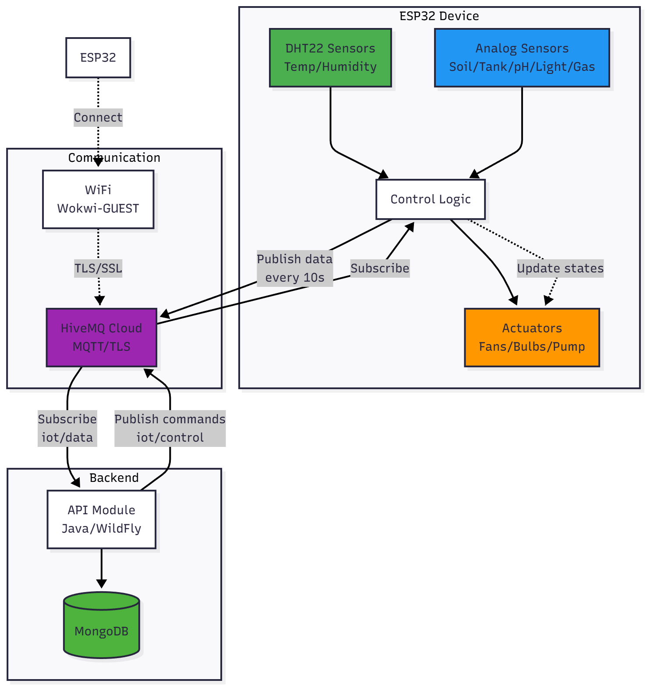

# 🌐 Smart Greenhouse IoT (ESP32 Firmware)

## 📋 Table of Contents

- [Overview](#-overview)
- [Hardware Architecture](#-hardware-architecture)
- [Sensors and Actuators](#-sensors-and-actuators)
- [Technologies and Libraries](#-technologies-and-libraries)
- [Installation and Configuration](#-installation-and-configuration)
- [MQTT Communication](#-mqtt-communication)
- [Operation Modes](#-operation-modes)
- [Wokwi Simulation](#-wokwi-simulation)
- [Deployment on Real ESP32](#-deployment-on-real-esp32)
- [Node-RED Integration](#-node-red-integration)
- [Troubleshooting](#-troubleshooting)

---

## 🎯 Overview

The **IoT** module is the embedded firmware for **ESP32** microcontroller that manages the smart greenhouse. It:

- 📊 **Collects data** from 9 environmental sensors
- 🎛️ **Controls 5 actuators** (fans, lights, pump)
- 📡 **Communicates via MQTT** with the cloud (HiveMQ)
- 🔄 **Supports 2 modes**: Automatic and Manual
- ⚡ **Reacts in real-time** to remote commands

### Main Features

- ✅ DHT22 sensor reading (indoor and outdoor temperature/humidity)
- ✅ Analog sensor reading (soil moisture, tank level, pH, light, gas)
- ✅ Automatic control based on configurable thresholds
- ✅ Manual control via MQTT commands
- ✅ Periodic data publication (every 10 seconds)
- ✅ Secure MQTT connection over TLS (port 8883)
- ✅ Automatic WiFi and MQTT reconnection

---

## 🏗️ Hardware Architecture

### Connection Diagram

```
ESP32 DevKit
┌─────────────────────────────────────────┐
│                                         │
│  SENSORS (INPUT)                        │
│  ├─ GPIO 4  ← DHT22 Indoor              │
│  ├─ GPIO 5  ← DHT22 Outdoor             │
│  ├─ GPIO 34 ← MQ-2 Gas Sensor           │
│  ├─ GPIO 35 ← LDR (Light Sensor)        │
│  ├─ GPIO 32 ← Soil Moisture Sensor      │
│  ├─ GPIO 33 ← Tank Level Sensor         │
│  └─ GPIO 36 ← pH Sensor                 │
│                                         │
│  ACTUATORS (OUTPUT)                     │
│  ├─ GPIO 16 → Fan 1                     │
│  ├─ GPIO 17 → Fan 2                     │
│  ├─ GPIO 18 → Bulb 1 (pH Alert)         │
│  ├─ GPIO 19 → Bulb 2 (Grow Light)       │
│  └─ GPIO 21 → Water Pump                │
│                                         │
│  COMMUNICATION                          │
│  └─ WiFi + MQTT/TLS                     │
└─────────────────────────────────────────┘
```

### Data Flow Diagram



---

## 📡 Sensors and Actuators

### 🌡️ Sensors

| Sensor | GPIO | Type | Measurement | Range | Unit |
|---------|------|------|--------|-------|-------|
| **DHT22 Indoor** | 4 | Digital | Indoor temperature | -40 to 80°C | °C |
| | | | Indoor humidity | 0-100% | % |
| **DHT22 Outdoor** | 5 | Digital | Outdoor temperature | -40 to 80°C | °C |
| | | | Outdoor humidity | 0-100% | % |
| **MQ-2** | 34 (ADC) | Analog | Gas (CO, methane, smoke) | 0-4095 | - |
| **LDR** | 35 (ADC) | Analog | Light intensity | 0-4095 | - |
| **Soil Moisture** | 32 (ADC) | Analog | Soil moisture | 0-4095 | - |
| **Tank Level** | 33 (ADC) | Analog | Water tank level | 0-4095 | - |
| **pH Sensor** | 36 (ADC) | Analog | pH level | 0-4095 | - |

> 📌 **Note**: Analog sensors use the ESP32's internal ADC (12-bit, 0-4095).

### 🎛️ Actuators

| Actuator | GPIO | Type | Function | Control |
|------------|------|------|----------|----------|
| **Fan 1** | 16 | Digital OUT | Ventilation (temperature) | Automatic / Manual |
| **Fan 2** | 17 | Digital OUT | Ventilation (temperature) | Automatic / Manual |
| **Bulb 1** | 18 | Digital OUT | pH alarm (red) | Automatic / Manual |
| **Bulb 2** | 19 | Digital OUT | Grow lighting | Automatic / Manual |
| **Pump** | 21 | Digital OUT | Automatic irrigation | Automatic / Manual |

---

## 🛠️ Technologies and Libraries

### Platform and Framework

| Technology | Version | Description |
|------------|---------|-------------|
| **PlatformIO** | Latest | Build system and library manager |
| **Arduino Framework** | Latest | Development framework for ESP32 |
| **ESP32 DevKit** | - | Development board |

### Arduino Libraries

| Library | Version | Description |
|-------------|---------|-------------|
| **WiFi.h** | Built-in | WiFi connection for ESP32 |
| **WiFiClientSecure.h** | Built-in | SSL/TLS client for secure connections |
| **PubSubClient** | 2.8 | MQTT client (by Nick O'Leary) |
| **DHT sensor library** | 1.4.3 | DHT22 sensor reading (Adafruit) |
| **ArduinoJson** | 6.21.0 | JSON parsing and generation |

### Development Environment

- **PlatformIO IDE** (VSCode Extension)
- **Wokwi Simulator** (for online simulation)
- **ESP-IDF** (optional, for advanced development)

---

## 📦 Installation and Configuration

### Prerequisites

1. **VSCode** with **PlatformIO** extension
   - Install VSCode: https://code.visualstudio.com/
   - Install PlatformIO extension: https://platformio.org/install/ide?install=vscode

2. **USB-to-Serial Driver** (for real ESP32)
   - CP2102 or CH340 depending on your board
   - Windows: https://www.silabs.com/developers/usb-to-uart-bridge-vcp-drivers

### Project Configuration

#### 1. Project Structure

```
iot/SmartGreenHouse/
├── platformio.ini           # PlatformIO configuration
├── src/
│   └── main.cpp             # Main source code
├── include/                 # Headers (optional)
├── lib/                     # Local libraries (optional)
├── diagram.json             # Wokwi wiring diagram
├── wokwi.toml              # Wokwi configuration
└── node_red.json           # Node-RED integration flow
```

#### 2. `platformio.ini` File

```ini
[env:esp32dev]
platform = espressif32
board = esp32dev
framework = arduino
monitor_speed = 115200
lib_deps =
    knolleary/PubSubClient @ ^2.8
    adafruit/DHT sensor library @ ^1.4.3
    bblanchon/ArduinoJson @ ^6.21.0
```

#### 3. WiFi and MQTT Configuration

Edit `src/main.cpp`:

```cpp
// ==================== WiFi Settings ====================
const char* ssid = "YOUR_WIFI_SSID";
const char* password = "YOUR_WIFI_PASSWORD";

// For Wokwi Simulator
// const char* ssid = "Wokwi-GUEST";
// const char* password = "";

// ==================== MQTT Settings ====================
const char* mqtt_server = "f7650e29f2d1418ab38a502a12ae2a8e.s1.eu.hivemq.cloud";
const int mqtt_port = 8883;
const char* mqtt_client_id = "ESP32_Greenhouse";
const char* mqtt_username = "YOUR_USERNAME";
const char* mqtt_password = "YOUR_PASSWORD";
```

####4. Threshold Configuration

```cpp
// ==================== Thresholds ====================
const int SOIL_THRESHOLD = 2000;      // Soil moisture threshold (irrigate if < 2000)
const int TANK_THRESHOLD = 1000;      // Tank level threshold (> 1000 to pump)
const int TEMP_THRESHOLD = 28;        // Temperature threshold (°C) for ventilation
const int LDR_THRESHOLD = 2000;       // Light threshold (lighting if < 2000)
const int PH_LOW = 1500;              // Low pH threshold
const int PH_HIGH = 3000;             // High pH threshold
```

> ⚠️ **Adjust these thresholds according to your needs**!

---

## 🔌 MQTT Communication

### MQTT Topics

| Topic | Direction | Description | Format |
|-------|-----------|-------------|--------|
| `iot/data` | ESP32 → Cloud | Sensor data + actuator states | JSON |
| `iot/control` | Cloud → ESP32 | Commands for actuators | JSON |
| `iot/mode` | Cloud → ESP32 | Mode change (auto/manual) | JSON |

### Message Formats

#### `iot/data` Message (Published by ESP32)

```json
{
  "TempIndoor": 25.5,
  "HumIndoor": 60.2,
  "TempOutdoor": 18.3,
  "HumOutdoor": 75.1,
  "Soil": 2100,
  "Tank": 1500,
  "pH": 2200,
  "Light": 1800,
  "Gas": 450,
  "Fan1": 1,
  "Fan2": 1,
  "Bulb1": 0,
  "Bulb2": 1,
  "Pump": 0,
  "Mode": "auto"
}
```

**Frequency**: Every 10 seconds.

#### `iot/control` Message (Received by ESP32)

**Single actuator control**:
```json
{
  "Fan1": true
}
```

**Multiple actuator control**:
```json
{
  "Fan1": false,
  "Fan2": false,
  "Bulb2": true,
  "Pump": true
}
```

#### `iot/mode` Message (Mode Change)

**Switch to automatic mode**:
```json
{
  "Mode": "auto"
}
```

### MQTT Handling Code

```cpp
void callback(char* topic, byte* payload, unsigned int length) {
  String msg = "";
  for (int i = 0; i < length; i++) msg += (char)payload[i];
  
  StaticJsonDocument<200> doc;
  DeserializationError error = deserializeJson(doc, msg);
  
  if (!error) {
    // Manual command received
    if (doc.containsKey("Fan1")) {
      manualMode = true;
      manualFan1 = doc["Fan1"];
      applyActuatorCommands();
    }
    
    // Return to automatic mode
    if (doc.containsKey("Mode") && strcmp(doc["Mode"], "auto") == 0) {
      manualMode = false;
    }
  }
}
```

---

## 🔄 Operation Modes

### Automatic Mode (default)

The ESP32 controls actuators according to **predefined rules**:

| Actuator | Activation Condition |
|------------|------------------------|
| **Fan1, Fan2** | Indoor temperature > 28°C |
| **Bulb1** (pH Alert) | pH < 1500 OR pH > 3000 |
| **Bulb2** (Lighting) | Light < 2000 |
| **Pump** | Soil moisture < 2000 AND Tank level > 1000 |

**Automatic logic code**:

```cpp
if (!manualMode) {
  float tempIndoor = dhtIndoor.readTemperature();
  int light = analogRead(LDR_SENSOR);
  int ph = analogRead(POT_PH);
  int soil = analogRead(POT_SOIL);
  int tank = analogRead(POT_TANK);
  
  fan1State = (tempIndoor > TEMP_THRESHOLD);
  fan2State = fan1State;
  bulb2State = (light < LDR_THRESHOLD);
  bulb1State = (ph < PH_LOW || ph > PH_HIGH);
  pumpState = (soil < SOIL_THRESHOLD && tank > TANK_THRESHOLD);
  
  digitalWrite(FAN1, fan1State);
  digitalWrite(FAN2, fan2State);
  digitalWrite(BULB1, bulb1State);
  digitalWrite(BULB2, bulb2State);
  digitalWrite(PUMP, pumpState);
}
```

### Manual Mode

The ESP32 **disables automatic logic** and obeys **only MQTT commands**.

**Switch to manual mode**:
- Automatically upon receiving a command on `iot/control`
- States remain constant until new command

**Return to automatic mode**:
```json
{
  "Mode": "auto"
}
```

---

## 🖥️ Wokwi Simulation

**Wokwi** is an online simulator for ESP32 that allows testing firmware without physical hardware.

### Wokwi Configuration

**`wokwi.toml` file**:

```toml
[wokwi]
version = 1
firmware = '.pio/build/esp32dev/firmware.bin'
elf = '.pio/build/esp32dev/firmware.elf'
```

**`diagram.json` file**:

This file contains the complete wiring diagram with all sensors and actuators connected to the ESP32.

### Running Simulation

#### Method 1: Wokwi VSCode Extension

1. Install Wokwi extension for VSCode
2. Open `diagram.json`
3. Click "Start Simulation"

#### Method 2: Wokwi CLI

```bash
# Compile firmware
pio run

# Run Wokwi
wokwi-cli --diagram diagram.json
```

#### Method 3: Wokwi Web (online simulation)

1. Go to https://wokwi.com/
2. Create new ESP32 project
3. Copy contents of `diagram.json` and `src/main.cpp`
4. Click "Start Simulation"

### Testing MQTT in Wokwi

The Wokwi simulator automatically connects to the Internet and can communicate with HiveMQ Cloud.

**Log verification**:
```
Connecting to WiFi...
WiFi connected!
Connecting to MQTT...
Connected!
{"TempIndoor":25.50,"HumIndoor":60.20,...}
```

---

## 🔧 Deployment on Real ESP32

### Flashing Steps

#### 1. Connect ESP32 via USB

Connect your ESP32 board to your computer via USB cable.

#### 2. Check COM Port

```bash
# On Windows (PowerShell)
Get-WmiObject Win32_SerialPort | Select-Object Name, DeviceID

# Or via PlatformIO
pio device list
```

**Example output**:
```
COM3 - USB-SERIAL CH340
```

#### 3. Compile and Flash

```bash
# Compile project
pio run

# Flash to ESP32
pio run --target upload

# Or in one command
pio run -t upload
```

#### 4. Serial Monitor

```bash
# Open serial monitor (115200 baud)
pio device monitor

# Or via PlatformIO IDE: click "Serial Monitor" icon
```

**Example output**:
```
Connecting to WiFi.....
WiFi connected!
Connecting to MQTT...
Connected!
{"TempIndoor":26.30,"HumIndoor":58.50,...}
```

### Flashing Troubleshooting

**Problem: "Failed to connect to ESP32"**

Solution:
1. Press **BOOT** button during flashing
2. Verify USB driver (CP2102 or CH340)
3. Try another USB cable (some only carry power)

**Problem: "WiFi connection failed"**

Solution:
1. Verify WiFi SSID and password
2. Ensure network is 2.4 GHz (ESP32 doesn't support 5 GHz)
3. Verify network doesn't have captive portal

**Problem: "MQTT connection failed"**

Solution:
1. Verify HiveMQ Cloud credentials
2. Verify ESP32 Internet connectivity
3. Test MQTT connection with desktop client (MQTT Explorer)

---

## 🔗 Node-RED Integration

**Node-RED** can serve as a bridge between MQTT and the API for data processing or custom business rules.

### Node-RED Flow (`node_red.json`)

The included `node_red.json` file contains a ready-to-use flow that:

1. **Subscribes** to `iot/data` topic
2. **Parses** JSON
3. **Sends** data to API via POST `/rest/sensors`
4. **Subscribes** to API commands
5. **Publishes** to `iot/control`

### Importing Flow

1. Open Node-RED (http://localhost:1880)
2. Menu → Import → Clipboard
3. Paste contents of `node_red.json`
4. Deploy

### MQTT Node Configuration

**Broker**:
- Server: `f7650e29f2d1418ab38a502a12ae2a8e.s1.eu.hivemq.cloud`
- Port: `8883`
- Protocol: `MQTT V3.1.1`
- Use TLS: ✅
- Username: `marwen`
- Password: `M1arwen#`

---

## 🧪 Testing and Validation

### Sensor Testing

```cpp
void setup() {
  Serial.begin(115200);
  dhtIndoor.begin();
  
  // Test DHT22
  float temp = dhtIndoor.readTemperature();
  Serial.print("Temperature: ");
  Serial.println(temp);
  
  // Test analog sensors
  int soil = analogRead(POT_SOIL);
  Serial.print("Soil Moisture: ");
  Serial.println(soil);
}
```

### Actuator Testing

```cpp
void loop() {
  // Test Fan1
  digitalWrite(FAN1, HIGH);
  delay(2000);
  digitalWrite(FAN1, LOW);
  delay(2000);
}
```

### MQTT Testing

Use **MQTT Explorer** to test communication:

1. Download MQTT Explorer: http://mqtt-explorer.com/
2. Connect to HiveMQ Cloud broker
3. Monitor `iot/data` topic
4. Publish to `iot/control` to test commands

---

## 📊 Monitoring and Logs

### Serial Logs

```cpp
Serial.begin(115200);
Serial.println("Smart Greenhouse - ESP32 Firmware v1.0");
Serial.print("Connecting to WiFi: ");
Serial.println(ssid);
```

### MQTT Debug

```cpp
if (client.connect(mqtt_client_id, mqtt_username, mqtt_password)) {
  Serial.println("MQTT Connected!");
} else {
  Serial.print("MQTT Failed, rc=");
  Serial.println(client.state());
  // -4 : Connection timeout
  // -3 : Connection lost
  // -2 : Connect failed
  // -1 : Disconnected
  //  0 : Connected
  //  1 : Bad protocol
  //  2 : ID rejected
  //  3 : Server unavailable
  //  4 : Bad credentials
  //  5 : Not authorized
}
```

---

## 🔐 Security

### Secure MQTT Connection

```cpp
WiFiClientSecure espClient;
espClient.setInsecure();  // For Wokwi (accepts all certificates)

// For production, use CA certificate:
// espClient.setCACert(root_ca);
```

### Best Practices

⚠️ **For production**:
1. **Don't hardcode credentials** in code
2. Use SPIFFS to store configuration
3. Implement OTA (Over-The-Air) updates
4. Validate SSL certificates
5. Change default MQTT credentials

---

## 📝 Release Notes

### v1.0 - Current Features

- ✅ Support for 9 sensors (DHT22 x2, analog x5)
- ✅ Control of 5 actuators
- ✅ MQTT over TLS (HiveMQ Cloud)
- ✅ Automatic mode with configurable rules
- ✅ Manual mode via MQTT commands
- ✅ Automatic WiFi/MQTT reconnection
- ✅ Periodic publication (10s)
- ✅ Wokwi Simulator compatible

### Future Improvements

- 🔄 WiFi configuration via captive portal (WiFiManager)
- 🔄 OTA (Over-The-Air) firmware updates
- 🔄 Deep Sleep for power saving
- 🔄 Automatic sensor calibration
- 🔄 Watchdog timer for robustness
- 🔄 ESP-NOW support for mesh networking

---

## 📚 Additional Resources

### Official Documentation

- **ESP32**: https://docs.espressif.com/projects/esp-idf/
- **PlatformIO**: https://docs.platformio.org/
- **Arduino-ESP32**: https://github.com/espressif/arduino-esp32
- **PubSubClient**: https://pubsubclient.knolleary.net/
- **DHT Library**: https://github.com/adafruit/DHT-sensor-library

### Tutorials

- **ESP32 with MQTT**: https://randomnerdtutorials.com/esp32-mqtt-publish-subscribe-arduino-ide/
- **DHT22 with ESP32**: https://randomnerdtutorials.com/esp32-dht11-dht22-temperature-humidity-sensor-arduino-ide/
- **Wokwi Simulator**: https://docs.wokwi.com/

---

## 🤝 Support

For questions or issues:

1. Check serial monitor logs
2. Test WiFi connection
3. Test MQTT connection with MQTT Explorer
4. Verify wiring (if real ESP32)
5. Consult PlatformIO documentation

---

## 📄 License

This project is developed as part of an academic Smart Greenhouse project.


