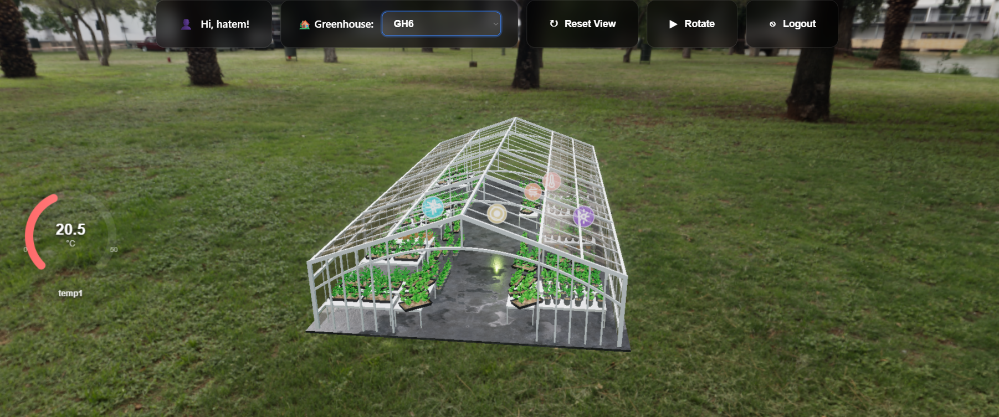
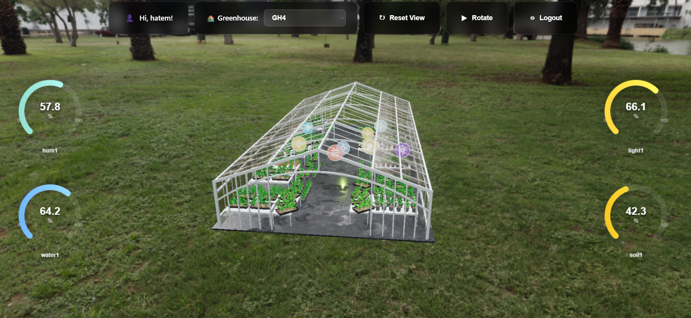
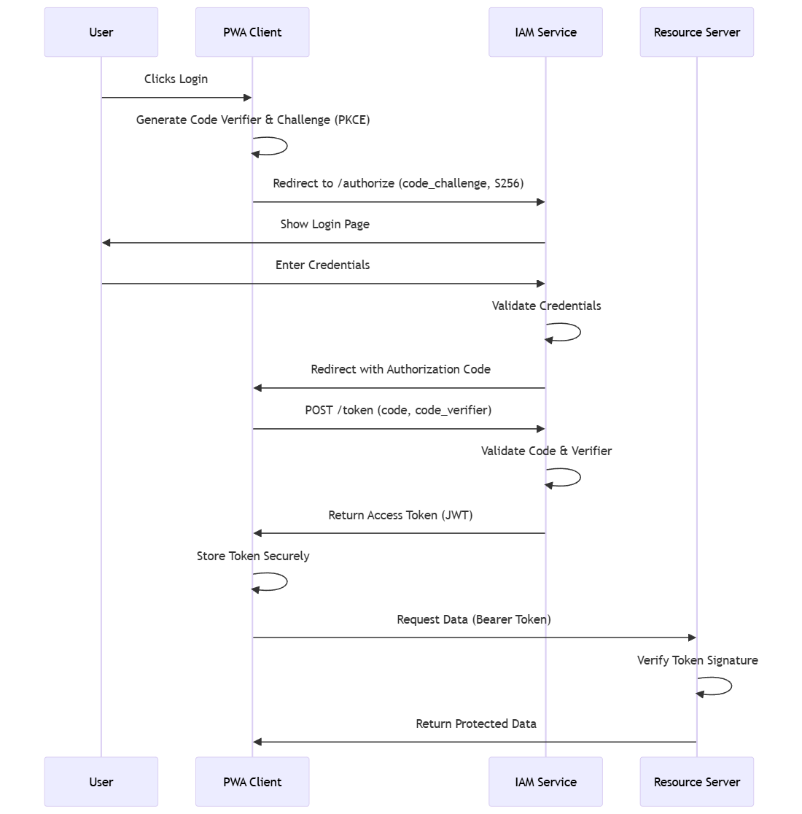

# 🌱 Smart Greenhouse PWA (Progressive Web Application)

## 📋 Table of Contents

- [Overview](#-overview)
- [Architecture](#-architecture)
- [Features](#-features)
- [Technologies](#-technologies)
- [Installation and Configuration](#-installation-and-configuration)
- [3D Visualization](#-3d-visualization)
- [Sensor Data](#-sensor-data)
- [Actuator Controls](#-actuator-controls)
- [Authentication](#-authentication)
- [Offline Capabilities](#-offline-capabilities)
- [Deployment](#-deployment)

---

## 🎯 Overview

The **PWA** (Progressive Web Application) is the frontend interface for the Smart Greenhouse system. It provides:

- 🏰 **3D Greenhouse Visualization**: Interactive Three.js 3D model
- 📊 **Real-time Sensor Monitoring**: Live data with gauges and charts
- 🎛️ **Actuator Control**: Manual control of fans, lights, and pump

### Screenshots

*3D Visualization and Control Interface*


*Real-time Sensor Data Monitoring*

- 🔐 **Secure Authentication**: OAuth2 integration with IAM module
- 📱 **Progressive Web App**: Installable, offline-capable application

### Main Features

- ✅ Interactive 3D greenhouse model with clickable sensors
- ✅ Real-time sensor data visualization with gauges
- ✅ Historical data charts with Chart.js
- ✅ Manual actuator control (ON/OFF toggles)
- ✅ OAuth2 authentication with **PKCE** security
- ✅ Service Worker for offline functionality
- ✅ Responsive design with glassmorphism UI

---

## 🏗️ Architecture

###Project Structure

```
pwa/Smart-Greenhouse/
├── index.html              # Main HTML file
├── manifest.json           # PWA manifest
├── sw.js                   # Service Worker
├── css/
│   └── style.css           # Application styles
├── js/
│   ├── main.js             # Main application logic
│   ├── mvp.js              # 3D viewer and sensor management
│   ├── auth.js             # Authentication manager
│   └── config.js           # API configuration
├── assets/
│   ├── greenhouse.glb      # 3D greenhouse model
│   ├── background.jpg      # Skybox background
│   └── svg/                # SVG icons for sensors
├── icons/                  # PWA icons (various sizes)
├── images/                 # Image assets
└── server.py              # Development server (Python)
```


---

## 🌟 Features

### 1. 3D Greenhouse Visualization

- **Interactive 3D Model**: Realistic greenhouse model loaded from GLB format
- **Clickable Sensors**: Click on sensors in 3D to view details
- **Clickable Actuators**: Click on actuators to view state and control
- **Dynamic Lighting**: Realistic lighting with shadows and reflections
- **Environment Mapping**: Skybox background with environment reflections
- **Camera Controls**: Orbit controls for rotation, zoom, and pan

### 2. Real-time Sensor Monitoring

**Sensor Types**:
- 🌡️ **Temperature** (Indoor/Outdoor)
- 💧 **Humidity** (Indoor/Outdoor)
- 🌱 **Soil Moisture**
- 💧 **Water Tank Level**
- 🧪 **pH Level**
- 💡 **Light Intensity**
- 💨 **Gas Level**

**Visualization**:
-Animated gauge displays
- Color-coded status (green/yellow/red)
- Real-time updates every 10 seconds
- Popup details with sensor information

### 3. Historical Data Charts

- **Interactive Charts**: Chart.js line charts for historical data
- **Time Ranges**: 1H, 6H, 24H, 7D selectable ranges
- **Statistics**: Average, Maximum, Minimum, Trend
- **Responsive**: Auto-updating when popup is open

### 4. Actuator Controls

**Actuators**:
- 🌀 **Fan 1 & Fan 2**: Temperature control ventilation
- 💡 **Bulb 1**: pH alert light (red)
- 💡 **Bulb 2**: Grow light
- 💧 **Water Pump**: Irrigation system

**Control Features**:
- ON/OFF toggle buttons
- Visual feedback (3D model updates)
- Status persistence
- Manual override of automatic mode

### 5. Authentication

- **OAuth2 Flow**: Authorization Code Flow with **PKCE** (Proof Key for Code Exchange)
- **Security**: SHA-256 code challenge generation for enhanced security
- **IAM Integration**: Seamless integration with IAM module  
- **Secure Cookies**: HttpOnly cookies for JWT storage
- **Auto-redirect**: Automatic login redirection
- **Logout**: Clean session termination

### 6. PWA Features

- **Installable**: Can be installed like a native app
- **Offline Mode**: Service Worker caches assets
- **Responsive**: Works on desktop, tablet, and mobile
- **App-like Experience**: Full-screen standalone mode

---

## 🛠️ Technologies

### Frontend Frameworks

| Technology | Version | Description |
|------------|---------|-------------|
| **Three.js** | 0.160.0 | 3D graphics library |
| **Chart.js** | Latest | Data visualization charts |
| **ES6 Modules** | Native | Modern JavaScript modules |

### 3D Assets

| Asset | Format | Description |
|-------|--------|-------------|
| **Greenhouse Model** | GLB | 3D model with materials and textures |
| **Background** | JPG | Skybox environment map |
| **Sensor Icons** | SVG | Vector icons for sensor types |

### PWA Technologies

| Feature | Technology | Description |
|---------|-----------|-------------|
| **Service Worker** | JavaScript | Offline caching and updates |
| **Web App Manifest** | JSON | PWA configuration |
| **Install Prompt** | Browser API | Custom install UI |

### Authentication

| Technology | Description |
|------------|-------------|
| **OAuth2** | Authorization Code Flow |
| **JWT** | JSON Web Tokens in HttpOnly cookies |
| **PKCE** | **SHA-256** Code Challenge (Mandatory) |

---

## 📦 Installation and Configuration

### Prerequisites

1. **Web Browser** (Chrome, Firefox, Edge, Safari)
2. **Backend Services** running:
   - API Module (http://localhost:8080/smartgreenhouse)
   - IAM Module (http://localhost:8080/iam-1.0)

### Installation Steps

#### 1. Clone the Project

```bash
git clone https://github.com/defk0n1/Smart-Greenhouse.git
cd smart-greenhouse/pwa/Smart-Greenhouse
```

#### 2. Configuration

Edit `js/config.js`:

```javascript
export const API_CONFIG = {
    // Backend URLs
    BASE_URL: window.location.hostname === 'localhost'
        ? 'http://localhost:8080'
        : window.location.origin,
    
    // IAM Authentication
    IAM_BASE_URL: 'http://localhost:8080/iam-1.0/rest-iam',
    IAM_AUTHORIZE_URL: 'http://localhost:8080/iam-1.0/rest-iam/oauth/authorize',
    IAM_TOKEN_URL: 'http://localhost:8080/iam-1.0/rest-iam/oauth/token',
    
    // OAuth2 Client
    CLIENT_ID: 'smartgreenhouse',
    REDIRECT_URI: 'http://localhost:8000/index.html',
    
    // Authentication Settings
    AUTH_REQUIRED: true,  // Set to false to disable authentication
    
    // Data Update Interval
    UPDATE_INTERVAL: 10000  // 10 seconds
};
```

#### 3. Start Development Server

**Option A: Python Server (Recommended)**

```bash
# Using included Python server
python server.py
```

**Option B: Node.js Server**

```bash
# Install http-server globally
npm install -g http-server

# Start server
http-server -p 8000 --cors
```

**Option C: VSCode Live Server**

1. Install "Live Server" extension in VSCode
2. Right-click `index.html`
3. Select "Open with Live Server"

#### 4. Access Application

Open browser and navigate to:
- **Local**: http://localhost:8000
- **Network**: http://[YOUR_IP]:8000

### First Launch

1. Application will redirect to IAM login
2. Enter credentials or register new account
3. After successful login, you'll be redirected back to PWA
4. 3D greenhouse will load with real-time data

---

## 🎨 3D Visualization

### Loading the 3D Model

The application uses Three.js GLTFLoader to load the greenhouse model:

```javascript
import { GLTFLoader } from 'three/addons/loaders/GLTFLoader.js';

const loader = new GLTFLoader();
loader.load('assets/greenhouse.glb', (gltf) => {
    scene.add(gltf.scene);
    // Setup sensors and actuators
});
```

### Sensor Representation

Sensors are represented as interactive 3D objects in the greenhouse:

```javascript
// Create sensor mesh
const geometry = new THREE.CircleGeometry(0.15, 32);
const material = new THREE.MeshBasicMaterial({
    map: svgTexture,
    transparent: true
});
const sensor = new THREE.Mesh(geometry, material);
sensor.userData = {
    type: 'sensor',
    sensorType: 'temperature',
    name: 'Indoor Temperature'
};
```

### Camera Controls

OrbitControls allow interactive camera manipulation:

```javascript
import { OrbitControls } from 'three/addons/controls/OrbitControls.js';

const controls = new OrbitControls(camera, renderer.domElement);
controls.enableDamping = true;
controls.dampingFactor = 0.05;
controls.maxPolarAngle = Math.PI / 2;
```

### Post-Processing Effects

- **SSAO** (Screen Space Ambient Occlusion): Realistic shadows
- **Bloom**: Glowing light effects
- **Tone Mapping**: Realistic color rendering

---

## 📊 Sensor Data

### Data Fetching

Sensor data is fetched from the API every 10 seconds:

```javascript
async function fetchSensorData() {
    const response = await fetch(`${API_CONFIG.BASE_URL}/sensors/latest`, {
        credentials: 'include'  // Include cookies for authentication
    });
    const data = await response.json();
    updateSensors(data);
}

setInterval(fetchSensorData, API_CONFIG.UPDATE_INTERVAL);
```

### Data Structure

```javascript
{
    "_id": "674c123abc456def78901234",
    "temperature_indoor": 25.5,
    "humidity_indoor": 60.2,
    "temperature_outdoor": 18.3,
    "humidity_outdoor": 75.1,
    "soil_moisture": 2100,
    "tank_level": 1500,
    "ph_level": 2200,
    "light_intensity": 1800,
    "gas_level": 450,
    "measurement_time": "2025-12-01T20:30:15Z"
}
```

### Gauge Visualization

Sensor values are displayed in animated canvas gauges:

```javascript
function drawGauge(ctx, value, min, max, label, unit) {
    // Clear canvas
    ctx.clearRect(0, 0, canvas.width, canvas.height);
    
    // Draw arc
    const angle = ((value - min) / (max - min)) * Math.PI;
    ctx.beginPath();
    ctx.arc(90, 100, 70, Math.PI, angle + Math.PI);
    ctx.strokeStyle = getColor(value, min, max);
    ctx.lineWidth = 15;
    ctx.stroke();
    
    // Draw value
    ctx.fillStyle = '#fff';
    ctx.font = 'bold 24px Arial';
    ctx.textAlign = 'center';
    ctx.fillText(`${value.toFixed(1)}${unit}`, 90, 110);
}
```

---

## 🎛️ Actuator Controls

### Control Interface

Actuators can be controlled via toggle buttons:

```html
<div class="actuator-controls">
    <button class="toggle-btn" data-actuator="Fan1" data-state="on">
        Fan 1: ON
    </button>
    <button class="toggle-btn" data-actuator="Fan2" data-state="off">
        Fan 2: OFF
    </button>
</div>
```

### Sending Commands

Commands are sent to the API, which publishes to MQTT:

```javascript
async function controlActuator(actuatorName, state) {
    const response = await fetch(
        `${API_CONFIG.BASE_URL}/actuators/${actuatorName}`,
        {
            method: 'POST',
            headers: { 'Content-Type': 'application/json' },
            credentials: 'include',
            body: JSON.stringify({ state })
        }
    );
    
    if (response.ok) {
        console.log(`${actuatorName} set to ${state ? 'ON' : 'OFF'}`);
        updateActuatorVisual(actuatorName, state);
    }
}
```

### Visual Feedback

Actuator states are reflected in the 3D model:

```javascript
function updateActuatorVisual(actuatorName, state) {
    const actuator = scene.getObjectByName(actuatorName);
    
    if (actuatorName.includes('Bulb')) {
        // Change bulb color and add/remove light
        actuator.material.emissive = state ? 
            new THREE.Color(0xffff00) : 
            new THREE.Color(0x000000);
    } else if (actuatorName.includes('Fan')) {
        // Rotate fan blades
        actuator.userData.rotating = state;
    } else if (actuatorName === 'Pump') {
        // Change pump color
        actuator.material.color = state ? 
            new THREE.Color(0x00ff00) : 
            new THREE.Color(0x808080);
    }
}
```

---

## 🔐 Authentication

### OAuth2 Flow



### Authentication Manager

The `auth.js` module manages authentication:

```javascript
export const authManager = {
    async checkSession() {
        // Check if JWT cookie exists
        const response = await fetch(`${API_CONFIG.API_BASE_URL}/sensors/latest`, {
            credentials: 'include'
        });
        return response.ok;
    },
    
    login() {
        // Redirect to IAM authorization endpoint
        const url = `${IAM_AUTHORIZE_URL}?` +
            `client_id=${CLIENT_ID}&` +
            `redirect_uri=${encodeURIComponent(REDIRECT_URI)}&` +
            `response_type=code&` +
            `scope=openid profile`;
        window.location.href = url;
    },
    
    async logout() {
        // Clear session and redirect to login
        document.cookie = 'access_token=; Max-Age=0';
        this.login();
    }
};
```

### Callback Handling

After IAM redirect, the PWA handles the authorization code:

```javascript
async function handleCallback(code, codeVerifier) {
    const response = await fetch(IAM_TOKEN_URL, {
        method: 'POST',
        headers: { 'Content-Type': 'application/x-www-form-urlencoded' },
        credentials: 'include',
        body: `grant_type=authorization_code&` +
              `code=${code}&` +
              `client_id=${CLIENT_ID}&` +
              `redirect_uri=${encodeURIComponent(REDIRECT_URI)}`
    });
    
    if (response.ok) {
        // Cookie is automatically set by IAM
        return { success: true };
    } else {
        return { success: false, error: 'Token exchange failed' };
    }
}
```

---

## 📱 Offline Capabilities

### Service Worker

The Service Worker (`sw.js`) provides offline functionality:

```javascript
const CACHE_NAME = 'greenhouse-v1';
const urlsToCache = [
    '/',
    '/index.html',
    '/css/style.css',
    '/js/main.js',
    '/js/mvp.js',
    '/js/auth.js',
    '/js/config.js',
    '/assets/greenhouse.glb',
    '/assets/background.jpg'
];

// Install event - cache resources
self.addEventListener('install', event => {
    event.waitUntil(
        caches.open(CACHE_NAME)
            .then(cache => cache.addAll(urlsToCache))
    );
});

// Fetch event - serve from cache, fallback to network
self.addEventListener('fetch', event => {
    event.respondWith(
        caches.match(event.request)
            .then(response => response || fetch(event.request))
    );
});
```

### PWA Manifest

The `manifest.json` makes the app installable:

```json
{
  "name": "Greenhouse 3D Viewer",
  "short_name": "Greenhouse3D",
  "description": "Interactive 3D visualization of a greenhouse with sensors",
  "start_url": "./",
  "display": "standalone",
  "background_color": "#0f172a",
  "theme_color": "#0f172a",
  "icons": [
    {
      "src": "icons/icon-512x512.png",
      "sizes": "512x512",
      "type": "image/png"
    }
  ]
}
```

### Installation Prompt

Custom install UI for better UX:

```javascript
let deferredPrompt;

window.addEventListener('beforeinstallprompt', (e) => {
    e.preventDefault();
    deferredPrompt = e;
    // Show custom install button
    document.getElementById('installPrompt').style.display = 'flex';
});

document.getElementById('installButton').addEventListener('click', async () => {
    deferredPrompt.prompt();
    const { outcome } = await deferredPrompt.userChoice;
    console.log(outcome === 'accepted' ? 'Installed' : 'Dismissed');
    deferredPrompt = null;
});
```

---

## 🚀 Deployment

### Production Build

#### 1. Update Configuration

Change `config.js` for production:

```javascript
export const API_CONFIG = {
    BASE_URL: 'https://api.greenhouse.com/rest',
    IAM_BASE_URL: 'https://iam.greenhouse.com/rest-iam',
    REDIRECT_URI: 'https://app.greenhouse.com/index.html',
    // ...
};
```

#### 2. Optimize Assets

```bash
# Compress images
# Minify CSS and JavaScript
# Optimize 3D model (reduce polygons, compress textures)
```

#### 3. Deploy to Static Hosting

**Option A: GitHub Pages**

```bash
# Push to gh-pages branch
git checkout -b gh-pages
git push origin gh-pages
```

**Option B: Netlify**

```bash
# Install Netlify CLI
npm install -g netlify-cli

# Deploy
netlify deploy --prod
```

**Option C: Vercel**

```bash
# Install Vercel CLI
npm install -g vercel

# Deploy
vercel --prod
```

###Production Checklist

- ✅ HTTPS enabled (required for PWA)
- ✅ Service Worker registered
- ✅ Manifest validated
- ✅ Icons in all required sizes
- ✅ API URLs updated for production
- ✅ OAuth redirect URIs configured
- ✅ CORS enabled on API

---

## 📝 Release Notes

### v1.0 - Current Features

- ✅ 3D greenhouse visualization with Three.js
- ✅ Real-time sensor data with gauges
- ✅ Historical charts with multiple time ranges
- ✅ Manual actuator controls
- ✅ OAuth2 authentication integration
- ✅ Service Worker for offline mode
- ✅ PWA installation support
- ✅ Responsive glassmorphism design

### Future Improvements

- 🔄 Push notifications for alerts
- 🔄 Multi-language support
- 🔄 Dark/Light theme toggle
- 🔄 Advanced analytics dashboard
- 🔄 Export data to CSV/PDF
- 🔄 WebSocket for real-time updates
- 🔄 Mobile app (React Native)

---

## 📄 License

This project is developed as part of an academic Smart Greenhouse project.
